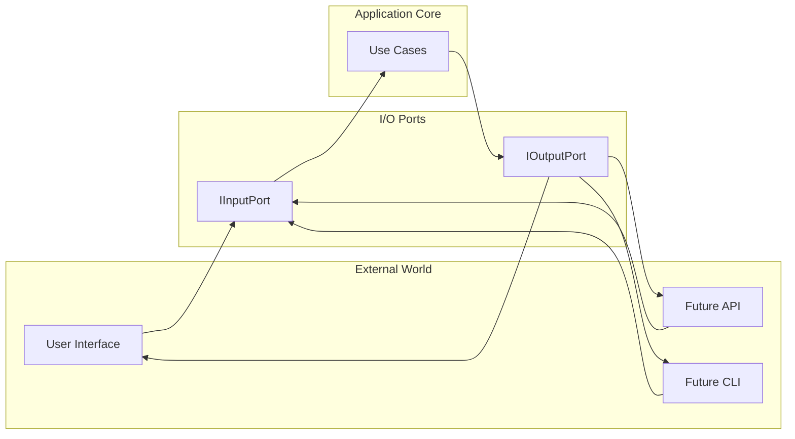
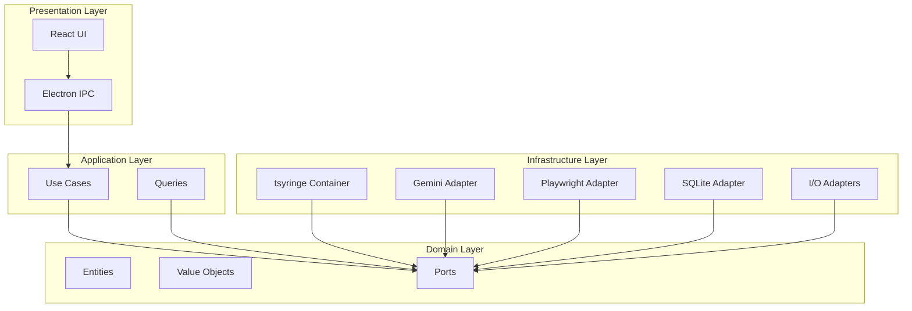

# Auto-QA System Architecture

A clean architecture design for an autonomous web testing agent with abstracted inputs/outputs and provider-agnostic infrastructure.

---

## Design Principles

| Principle | Implementation |
|-----------|----------------|
| **Multilayer Separation** | 4 distinct layers with enforced boundaries |
| **Provider Agnostic** | All external services behind interfaces |
| **Abstracted I/O** | Input/Output ports allow format changes without app changes |
| **Type Safety** | Branded types, discriminated unions, Result types |

---

## Agentic Runtime Contract

Domia runtime changes MUST comply with the contract defined in
[AGENTIC_RUNTIME_EXECUTION_PLAN.md](./AGENTIC_RUNTIME_EXECUTION_PLAN.md).

### Runtime invariants

1. The model decides the next action/tool call within the runtime-exposed capability set.
2. Runtime enforces safety and correctness contracts (schema, policy, budgets), not tactical micromanagement.
3. Planner, actor, and evaluator stay role-separated.
4. A single lifecycle owner drives run transitions.
5. LLM and execution failures use typed semantics.
6. Policy behavior remains declarative and configurable where possible.

### Acceptance checks for runtime PRs

- [ ] No deterministic tactical tool substitution was added in the normal execution path.
- [ ] New failure paths are represented via typed outcomes, not ad-hoc string matching.
- [ ] Role boundaries (planner/actor/evaluator) are preserved.
- [ ] Policy changes are configuration/policy-driven, not scattered constants.
- [ ] Telemetry fields for new transitions/failures are explicit and structured.

---

## Technology Stack

| Category | Library | Purpose |
|----------|---------|---------|
| **Shell** | [electron-vite](https://github.com/electron-vite/electron-vite-react) | Electron + React + Vite |
| **Result Types** | [neverthrow](https://github.com/supermacro/neverthrow) | Type-safe error handling |
| **DI Container** | [tsyringe](https://github.com/microsoft/tsyringe) | Dependency injection |
| **LLM API** | [@google/generative-ai](https://github.com/google/generative-ai-js) | Google Gemini LLM |
| **Browser** | [Playwright](https://playwright.dev) | Browser automation |
| **Storage** | [better-sqlite3](https://github.com/WiseLibs/better-sqlite3) | Local persistence |
| **UI State** | [zustand](https://github.com/pmndrs/zustand) | React state management |

---

## Application Interface

### Input/Output Ports

The application's external interface is abstracted through ports, allowing the input format (currently URL + prompt) and output format (currently response + file) to change without modifying core logic.



### Input Port

```typescript
// src/domain/ports/IInputPort.ts
import { Result } from 'neverthrow';

// Current input shape - can be extended without breaking consumers
export interface TestInput {
  readonly url: string;
  readonly prompt: string;
  readonly options?: TestOptions;
}

export interface TestOptions {
  readonly headless?: boolean;
  readonly maxSteps?: number;
  readonly provider?: string;
}

// Port interface - implementations can parse from CLI, API, UI, etc.
export interface IInputPort {
  parse(raw: unknown): Result<TestInput, InputValidationError>;
  validate(input: TestInput): Result<ValidatedTestInput, InputValidationError>;
}
```

### Output Port

```typescript
// src/domain/ports/IOutputPort.ts
import { ResultAsync } from 'neverthrow';

// Current output shape - can be extended without breaking consumers
export interface TestOutput {
  readonly response: TestResponse;
  readonly file: OutputFile;
}

export interface TestResponse {
  readonly success: boolean;
  readonly summary: string;
  readonly steps: readonly StepSummary[];
  readonly duration: number;
  readonly error?: string;
}

export interface OutputFile {
  readonly path: string;
  readonly type: 'video' | 'trace' | 'report';
  readonly size: number;
}

// Port interface - implementations can format for CLI, API, UI, etc.
export interface IOutputPort {
  format(result: TestRun): TestOutput;
  save(output: TestOutput): ResultAsync<void, OutputError>;
}
```

### Why Abstracted I/O?

| Scenario | Without Abstraction | With Abstraction |
|----------|---------------------|------------------|
| Add new input field | Modify use cases, UI, validation | Add to `TestInput`, update adapter |
| Change output format | Modify use cases, storage, UI | Update `IOutputPort` implementation |
| Add CLI interface | Rewrite input parsing | Create new `IInputPort` adapter |
| Add REST API | Duplicate validation logic | Create new `IInputPort` adapter |

---

## Architecture Overview



---

## Layer Definitions

### Layer 1: Domain (Innermost)

Zero external dependencies except `neverthrow`. Contains business logic and contracts.

| Component | Purpose |
|-----------|---------|
| **Entities** | `TestRun`, `TestStep`, `Agent` |
| **Value Objects** | `Url`, `ElementId`, `TestRunId` (branded types) |
| **Ports** | Interfaces for all external capabilities |
| **Errors** | Typed domain errors |

```typescript
// Ports use ResultAsync for async operations
export interface IBrowserAutomation {
  navigateTo(url: Url): ResultAsync<void, NavigationError>;
  click(element: ElementId): ResultAsync<void, InteractionError>;
  snapshot(): ResultAsync<DOMSnapshot, SnapshotError>;
}

export interface ILLMProvider {
  generateAction(context: LLMContext): ResultAsync<AgentAction, LLMError>;
}
```

### Layer 2: Application

Orchestrates domain objects. Depends only on domain layer.

```typescript
@injectable()
export class RunTestUseCase {
  constructor(
    @inject('IInputPort') private input: IInputPort,
    @inject('IOutputPort') private output: IOutputPort,
    @inject('IBrowserAutomation') private browser: IBrowserAutomation,
    @inject('ILLMProvider') private llm: ILLMProvider
  ) {}
  
  execute(raw: unknown): ResultAsync<TestOutput, TestError> {
    return this.input.parse(raw)
      .asyncAndThen(input => this.input.validate(input))
      .andThen(validated => this.runTest(validated))
      .andThen(run => okAsync(this.output.format(run)));
  }
}
```

### Layer 3: Infrastructure

Implements all ports. Contains external library integrations.

| Adapter | Implements | Technology |
|---------|------------|------------|
| `UIInputAdapter` | `IInputPort` | Parses from React forms |
| `FileOutputAdapter` | `IOutputPort` | Writes to filesystem |
| `PlaywrightAdapter` | `IBrowserAutomation` | Playwright |
| `GeminiAdapter` | `ILLMProvider` | @google/generative-ai SDK |
| `SQLiteAdapter` | `ITestRunStorage` | better-sqlite3 |

### Layer 4: Presentation (Outermost)

User interface. Depends on application layer only.

---

## Dependency Rules

```
domain/         → ✅ neverthrow only
application/    → ✅ domain/, neverthrow, tsyringe
infrastructure/ → ✅ domain/, all external libraries
presentation/   → ✅ application/, domain/, react, zustand
```

> **Inversion Rule**: Infrastructure implements Domain interfaces, never the reverse.

---

## Async & Concurrency Design

### The Challenge

The agent loop involves heavy I/O (browser automation, LLM calls) that must:
1. **Not block the UI** - Electron renderer must stay responsive
2. **Support cancellation** - User can stop mid-execution
3. **Stream updates** - Real-time feedback on each step

### Two-Level Async Strategy

| Level | Pattern | Scope | Purpose |
|-------|---------|-------|---------|
| **Atomic** | `ResultAsync<T, E>` | Single port call | Error-safe async operations |
| **Orchestration** | `AsyncGenerator` | Agent loop | Streaming events + cancellation |

### Level 1: Atomic Operations (Ports)

All port methods return `ResultAsync` for type-safe error handling:

```typescript
// Infrastructure adapters use ResultAsync for atomic ops
interface IBrowserAutomation {
  navigateTo(url: Url): ResultAsync<void, NavigationError>;
  snapshot(): ResultAsync<DOMSnapshot, SnapshotError>;
}

interface ILLMProvider {
  generateAction(context: LLMContext): ResultAsync<AgentAction, LLMError>;
}
```

### Level 2: Orchestration (Use Cases)

Use cases that coordinate multiple steps return `AsyncGenerator`:

```typescript
// Application layer uses AsyncGenerator for streaming
class RunTestUseCase {
  async *execute(input: TestInput): AsyncGenerator<TestRunEvent, TestOutput> {
    yield { type: 'started', testRunId };
    
    while (!done) {
      if (this.cancellation.requested) {
        yield { type: 'cancelled' };
        return;
      }
      
      yield { type: 'observing' };
      const snapshot = await this.browser.snapshot();
      
      yield { type: 'thinking' };
      const action = await this.llm.generateAction(context);
      
      yield { type: 'acting', action };
      await this.browser.perform(action);
    }
    
    return finalOutput;
  }
}
```

### Event Types

```typescript
// src/domain/events/TestRunEvent.ts
export type TestRunEvent =
  | { type: 'started'; testRunId: TestRunId }
  | { type: 'observing' }
  | { type: 'thinking' }
  | { type: 'acting'; action: AgentAction }
  | { type: 'step_complete'; step: TestStep }
  | { type: 'screenshot'; data: Buffer }
  | { type: 'error'; error: DomainError }
  | { type: 'cancelled' }
  | { type: 'completed'; output: TestOutput };
```

### Cancellation Pattern

```typescript
// Cooperative cancellation token
export interface CancellationToken {
  readonly requested: boolean;
  cancel(): void;
}

// Use case checks token between steps
if (this.cancellation.requested) {
  yield { type: 'cancelled' };
  return;
}
```

### UI Consumption

```typescript
// Presentation layer consumes the generator
const generator = useCase.execute(input);

for await (const event of generator) {
  switch (event.type) {
    case 'thinking':
      setStatus('Agent is thinking...');
      break;
    case 'acting':
      setCurrentAction(event.action);
      break;
    case 'completed':
      setResult(event.output);
      break;
  }
}
```

### Process Boundary (Electron)

```
┌─────────────────────────────────────────────────────────────┐
│  RENDERER PROCESS (UI)                                       │
│  ┌─────────────────────────────────────────────────────────┐ │
│  │ useTestRunStore.subscribe() ← IPC events                │ │
│  └─────────────────────────────────────────────────────────┘ │
├─────────────────────────────────────────────────────────────┤
│  IPC CHANNEL                                                 │
│  'test:event' → Streams TestRunEvent to renderer            │
│  'test:cancel' → Signals cancellation to main               │
├─────────────────────────────────────────────────────────────┤
│  MAIN PROCESS                                                │
│  ┌─────────────────────────────────────────────────────────┐ │
│  │ for await (event of useCase.execute()) {                │ │
│  │   ipcMain.emit('test:event', event);                    │ │
│  │ }                                                        │ │
│  └─────────────────────────────────────────────────────────┘ │
└─────────────────────────────────────────────────────────────┘
```

---

## Data Flow

```
┌─────────────────────────────────────────────────────────────────────┐
│  INPUT                                                               │
│  ┌─────────────────┐                                                │
│  │ url: string     │  → IInputPort.parse() → ValidatedTestInput     │
│  │ prompt: string  │                                                │
│  └─────────────────┘                                                │
└─────────────────────────────────────────────────────────────────────┘
                              │
                              ▼
┌─────────────────────────────────────────────────────────────────────┐
│  AGENT LOOP                                                          │
│                                                                      │
│  ┌──────────┐    ┌──────────┐    ┌──────────┐    ┌──────────┐      │
│  │ OBSERVE  │ →  │  THINK   │ →  │   ACT    │ →  │  CHECK   │ ─┐   │
│  │ snapshot │    │ LLM call │    │ browser  │    │ done?    │  │   │
│  └──────────┘    └──────────┘    └──────────┘    └──────────┘  │   │
│       ▲                                                │        │   │
│       └────────────────────────────────────────────────┘        │   │
│                              LOOP                               │   │
└─────────────────────────────────────────────────────────────────│───┘
                                                                  │
                                                                  ▼
┌─────────────────────────────────────────────────────────────────────┐
│  OUTPUT                                                              │
│  ┌─────────────────────────┐                                        │
│  │ response: TestResponse  │  ← IOutputPort.format() ← TestRun     │
│  │ file: OutputFile        │                                        │
│  └─────────────────────────┘                                        │
└─────────────────────────────────────────────────────────────────────┘
```

---

## Directory Structure

```
src/
├── domain/
│   ├── entities/           # TestRun, TestStep, Agent
│   ├── value-objects/      # Branded types, DOMSnapshot, AgentAction
│   ├── ports/              # All interfaces (IInputPort, IOutputPort, etc.)
│   └── errors/             # Typed domain errors
│
├── application/
│   ├── use-cases/          # RunTestUseCase, CancelTestUseCase
│   ├── queries/            # GetTestRunQuery, ListTestRunsQuery
│   └── dtos/               # Command and response DTOs
│
├── infrastructure/
│   ├── adapters/
│   │   ├── io/             # UIInputAdapter, FileOutputAdapter
│   │   ├── browser/        # PlaywrightAdapter
│   │   ├── llm/            # GeminiAdapter, GeminiToolCallingProvider
│   │   └── storage/        # SQLiteAdapter, FileSystemAdapter
│   ├── config/             # Provider configurations
│   └── di/                 # tsyringe container setup
│
├── presentation/
│   ├── electron/           # Main process, IPC handlers
│   └── renderer/           # React components, zustand stores
│
└── shared/                 # Cross-cutting utilities
```

---

## Extending the System

### Adding New Input Fields

```typescript
// 1. Extend TestInput (non-breaking)
export interface TestInput {
  readonly url: string;
  readonly prompt: string;
  readonly credentials?: Credentials;  // New field
}

// 2. Update UIInputAdapter to parse the new field
// No changes to use cases or domain logic
```

### Adding New Output Formats

```typescript
// 1. Extend TestOutput (non-breaking)
export interface TestOutput {
  readonly response: TestResponse;
  readonly file: OutputFile;
  readonly metrics?: PerformanceMetrics;  // New field
}

// 2. Update FileOutputAdapter to generate new format
// No changes to use cases or domain logic
```

### Adding New Interfaces (CLI, API)

```typescript
// 1. Create new input adapter
@injectable()
export class CLIInputAdapter implements IInputPort {
  parse(args: string[]): Result<TestInput, InputValidationError> { ... }
}

// 2. Register in DI container for CLI context
container.register('IInputPort', { useClass: CLIInputAdapter });
```
