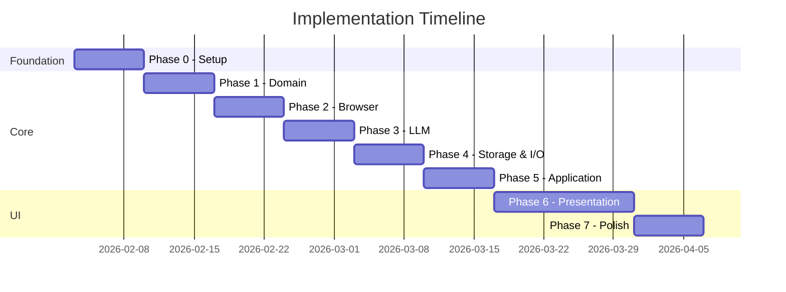

# Auto-QA Implementation Roadmap

A phased implementation plan leveraging open-source libraries to minimize boilerplate while maintaining clean architecture.

---

## Dependencies

```json
{
  "dependencies": {
    "neverthrow": "^7.0.0",
    "tsyringe": "^4.8.0",
    "reflect-metadata": "^0.2.0",
    "@google/generative-ai": "^0.24.1",
    "playwright": "^1.45.0",
    "better-sqlite3": "^11.0.0",
    "zustand": "^4.5.0",
    "nanoid": "^5.0.0"
  }
}
```

---

## Phase 0: Foundation (Week 1)

**Goal**: Project scaffolding with strict TypeScript and DI configuration.

| Task | Command/Action |
|------|----------------|
| Scaffold project | `npm create @electron-vite/create@latest . -- --template react-ts` |
| Install dependencies | See dependencies above |
| Configure TypeScript | Enable `experimentalDecorators`, `emitDecoratorMetadata` |
| Setup ESLint boundaries | Enforce layer import rules |
| Configure tsyringe | Add `import 'reflect-metadata'` to entry |

**Deliverables**: Working Electron shell, layer directories created, DI container initialized.

---

## Phase 1: Domain Layer (Week 2)

**Goal**: Complete domain model with abstracted I/O ports.

| Component | Implementation |
|-----------|----------------|
| **Branded Types** | `Url`, `ElementId`, `TestRunId` with validation |
| **Entities** | `TestRun`, `TestStep` with discriminated union states |
| **I/O Ports** | `IInputPort`, `IOutputPort` for abstracted app interface |
| **Core Ports** | `IBrowserAutomation`, `ILLMProvider`, `ITestRunStorage` |
| **Errors** | Typed domain errors extending base class |

```typescript
// Abstracted input - can change without affecting use cases
export interface TestInput {
  readonly url: string;
  readonly prompt: string;
}

// Abstracted output - can change without affecting use cases
export interface TestOutput {
  readonly response: TestResponse;
  readonly file: OutputFile;
}

export interface IInputPort {
  parse(raw: unknown): Result<TestInput, InputValidationError>;
}

export interface IOutputPort {
  format(run: TestRun): TestOutput;
}
```

**Deliverables**: All domain types, zero external dependencies except neverthrow.

---

## Phase 2: Browser Adapter (Week 3)

**Goal**: Playwright adapter implementing `IBrowserAutomation`.

| Method | Input | Output |
|--------|-------|--------|
| `launch()` | `LaunchOptions` | `ResultAsync<void, BrowserError>` |
| `navigateTo()` | `Url` | `ResultAsync<void, NavigationError>` |
| `click()` | `ElementId` | `ResultAsync<void, InteractionError>` |
| `type()` | `ElementId`, `string` | `ResultAsync<void, InteractionError>` |
| `snapshot()` | — | `ResultAsync<DOMSnapshot, SnapshotError>` |
| `screenshot()` | — | `ResultAsync<Buffer, CaptureError>` |

```typescript
@injectable()
export class PlaywrightAdapter implements IBrowserAutomation {
  navigateTo(url: Url): ResultAsync<void, NavigationError> {
    return ResultAsync.fromPromise(
      this.page.goto(url),
      (e) => new NavigationError(String(e))
    ).map(() => undefined);
  }
}
```

**Deliverables**: Full browser control, DOM snapshot extraction, video recording.

---

## Phase 3: LLM Adapter (Week 4)

**Goal**: Google Gemini adapter with tool calling support.

| Provider | Package | Model Examples |
|----------|---------|----------------|
| Google | `@google/generative-ai` | gemini-2.0-flash |

```typescript
@injectable()
export class GeminiAdapter implements ILLMProvider {
  generateAction(context: LLMContext): ResultAsync<AgentAction, LLMError> {
    return ResultAsync.fromPromise(
      this.generateWithRetry(context),
      (e) => new LLMError(String(e))
    );
  }
}
```

**Deliverables**: Multi-provider LLM, streaming support, response parsing.

---

## Phase 4: Storage & I/O Adapters (Week 5)

**Goal**: Persistence and I/O port implementations.

| Adapter | Port | Technology |
|---------|------|------------|
| `SQLiteAdapter` | `ITestRunStorage` | better-sqlite3 |
| `FileSystemAdapter` | `IArtifactStorage` | Node.js fs |
| `UIInputAdapter` | `IInputPort` | Parses React forms |
| `FileOutputAdapter` | `IOutputPort` | Writes response + file |

```typescript
@injectable()
export class UIInputAdapter implements IInputPort {
  parse(raw: unknown): Result<TestInput, InputValidationError> {
    const { url, prompt } = raw as Record<string, unknown>;
    return Url.create(url as string)
      .map(validUrl => ({ url: validUrl, prompt: prompt as string }));
  }
}

@injectable()
export class FileOutputAdapter implements IOutputPort {
  format(run: TestRun): TestOutput {
    return {
      response: { success: run.status.type === 'passed', ... },
      file: { path: this.artifactPath(run.id), type: 'video', ... }
    };
  }
}
```

**Deliverables**: Full DI container, all ports implemented.

---

## Phase 5: Application Layer (Week 6)

**Goal**: Use cases with AsyncGenerator for streaming and cancellation.

| Use Case | Pattern | Output |
|----------|---------|--------|
| `RunTestUseCase` | `AsyncGenerator` | Yields `TestRunEvent`, returns `TestOutput` |
| `CancelTestUseCase` | `ResultAsync` | `ResultAsync<void, Error>` |
| `GetTestRunQuery` | `ResultAsync` | `ResultAsync<TestOutput, Error>` |

### Event-Driven Agent Loop

```typescript
@injectable()
export class RunTestUseCase {
  constructor(
    @inject('IInputPort') private input: IInputPort,
    @inject('IOutputPort') private output: IOutputPort,
    @inject('IBrowserAutomation') private browser: IBrowserAutomation,
    @inject('ILLMProvider') private llm: ILLMProvider
  ) {}
  
  async *execute(
    raw: unknown,
    cancellation: CancellationToken
  ): AsyncGenerator<TestRunEvent, TestOutput> {
    
    const parsed = this.input.parse(raw);
    if (parsed.isErr()) {
      yield { type: 'error', error: parsed.error };
      return;
    }
    
    yield { type: 'started', testRunId };
    
    while (state.status.type === 'running') {
      // Cooperative cancellation check
      if (cancellation.requested) {
        yield { type: 'cancelled' };
        return;
      }
      
      // OBSERVE
      yield { type: 'observing' };
      const snapshotResult = await this.browser.snapshot();
      if (snapshotResult.isErr()) {
        yield { type: 'error', error: snapshotResult.error };
        break;
      }
      
      // THINK
      yield { type: 'thinking' };
      const actionResult = await this.llm.generateAction(context);
      if (actionResult.isErr()) {
        yield { type: 'error', error: actionResult.error };
        break;
      }
      
      // ACT
      yield { type: 'acting', action: actionResult.value };
      const actResult = await this.browser.perform(actionResult.value);
      
      yield { type: 'step_complete', step: currentStep };
    }
    
    return this.output.format(state);
  }
}
```

### Key Patterns

| Pattern | Purpose |
|---------|---------|
| `AsyncGenerator` | Yields events for UI, returns final result |
| `CancellationToken` | Cooperative stop between steps |
| `yield` before I/O | Real-time status updates |
| `ResultAsync` internally | Error-safe port calls |

**Deliverables**: Event-streaming agent loop, cooperative cancellation, real-time UI updates.

---

## Phase 6: Presentation Layer (Weeks 7-8)

**Goal**: Electron UI consuming use cases.

| Component | Technology | Purpose |
|-----------|------------|---------|
| IPC Bridge | Electron IPC | Main ↔ Renderer |
| State | zustand | `useTestRunStore` |
| Forms | React | URL + Prompt input |
| Results | React | Response + File display |

```typescript
// zustand store
export const useTestRunStore = create<Store>((set) => ({
  output: null,
  isRunning: false,
  runTest: async (url, prompt) => {
    set({ isRunning: true });
    const result = await window.api.runTest({ url, prompt });
    set({ output: result, isRunning: false });
  }
}));
```

**Deliverables**: Full UI, live status updates, file downloads.

---

## Phase 7: Polish (Week 9)

**Goal**: Production-ready packaging.

| Task | Tool |
|------|------|
| Installers | electron-builder |
| Playwright binaries | Post-install setup |
| Error handling | Toast notifications |
| Auto-update | electron-updater |

**Deliverables**: `.dmg` / `.exe` installers, smooth first-run experience.

---

## Timeline



---

## Extending the System

### Adding Input Fields

1. Extend `TestInput` interface in domain
2. Update `UIInputAdapter` to parse new field
3. No changes to use cases

### Adding Output Formats

1. Extend `TestOutput` interface in domain
2. Update `FileOutputAdapter` to generate new format
3. No changes to use cases

### Adding New Interface (CLI/API)

1. Create new `IInputPort` implementation
2. Create new `IOutputPort` implementation
3. Register in DI container
4. No changes to use cases
