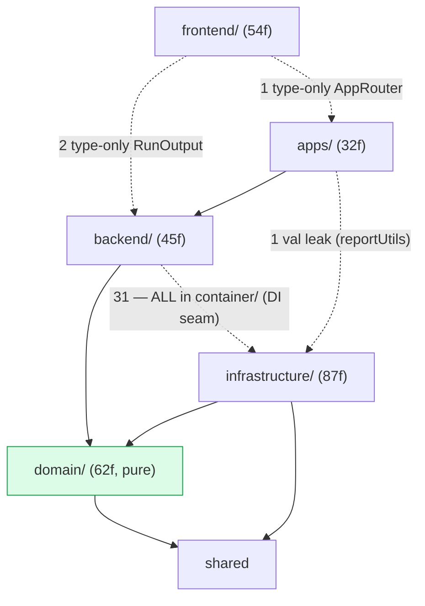
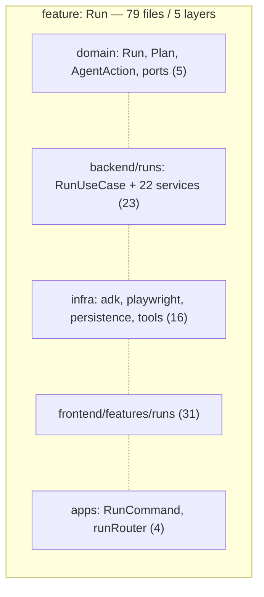
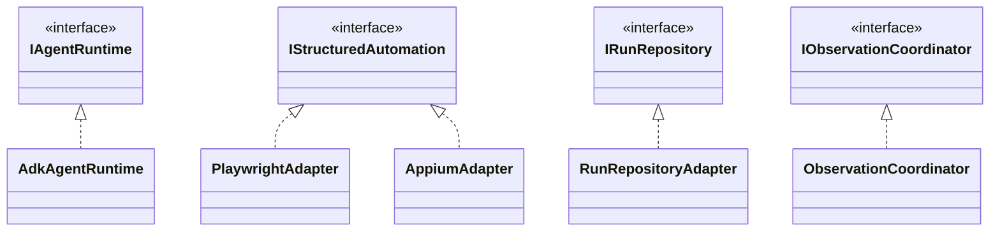

# Domia — Architecture Audit (measured signals)

> Living audit. Numbers are **measured** (`find`/`wc`/`knip`/import-graph), not estimated.
> Regenerate with the commands noted per section. Source = `src` layers excluding `*.test.ts`.

## 1. Size & shape (measured)

| Layer | files | LOC | avg LOC/file |
|---|--:|--:|--:|
| domain | 62 | 1667 | 26 |
| backend | 45 | 3073 | 68 |
| infrastructure | 87 | 6984 | 80 |
| frontend | 54 | 4307 | 79 |
| shared | 18 | 539 | 29 |
| apps | 32 | 2421 | 75 |
| **total** | **298** | **18991** | **64** |

Folder depth (dirs from root): depth-2 = 194 files, depth-3 = 49, depth-4 = 33, depth-5 = 11. Max depth 5. Shallow — not a nesting problem.

## 2. Dead code (measured)

`npx knip` → **0 unused files, 0 unused exports, 0 unused deps**. No `console.*` outside CLI, no `any`, no TODO/FIXME/HACK markers in src. **Dead-code ≈ 0%.** This is genuinely clean; not the problem.

## 3. God files (measured: src > 250 LOC)

| LOC | file | verdict |
|--:|---|---|
| 415 | `infrastructure/playwright/PlaywrightAdapter.ts` | cohesive (≈30 thin `resolveRef().andThen()` methods + tab mgmt sharing mutable `page`); splitting adds shared-state coupling |
| 329 | `apps/cli/RunCommand.ts` | mostly declarative option declarations + the event-render loop; already split (replay/resume/controls extracted) |
| 318 | `infrastructure/agent-runtime/adk/AdkAgentRuntime.ts` | already split (event-mapping extracted); remaining = the run loop + `prepareRunContext` |
| 292 | `infrastructure/playwright/electron/ElectronDriver.ts` | CDP connect + window discovery + lifecycle — **splittable** (connect / window-resolve / adapter-build) |
| 285 | `frontend/features/runs/components/RunForm.tsx` | form + platform fields + submit — **splittable** (StepInspector pattern) |
| 266 | `infrastructure/persistence/SQLiteWorkflowRepository.ts` | def + run + step-run CRUD + atomic txn — **splittable** by sub-aggregate |

**Signal: 3 genuine remaining god files** (ElectronDriver, RunForm, SQLiteWorkflowRepository). PlaywrightAdapter/RunCommand/AdkAgentRuntime are length-from-cohesion, not god-objects.

## 4. Coupling (measured: import graph)

Cross-layer import matrix (row imports col; counts of `@alias` imports):

| from\to | domain | backend | infra | frontend | shared | apps |
|---|--:|--:|--:|--:|--:|--:|
| domain | 36 | · | · | · | 3 | · |
| backend | 153 | 63 | **31** | · | 14 | · |
| infrastructure | 243 | · | 17 | · | 38 | · |
| frontend | 25 | **2** | · | 83 | 4 | **1** |
| shared | · | · | · | · | 3 | · |
| apps | 21 | 48 | **1** | · | 13 | · |

Boundary verdict (verified by grep, not matrix alone):
- **backend→infra = 31, ALL inside `backend/container/`** (the sanctioned DI seam). Non-container backend→infra = **0**. ✅ clean.
- **domain → only domain+shared.** ✅ pure.
- **frontend→backend = 2**: `import type { RunOutput } from '@backend/dto'` (store + useRunPanel). Type-only (erased at runtime). Inherent to a typed run-stream UI, but **un-guarded** by `check-architecture` (its `frontend-boundary` rule forbids only `@infrastructure`).
- **frontend→apps = 1**: `import type { AppRouter }` in `api/trpc.ts`. Type-only — the standard typed-tRPC client pattern. Acceptable but un-guarded.
- **apps→infra = 1**: `apps/cli/reportUtils.ts` → `ReportWriterService` (value import). CLI reaches infra directly; should go through a backend facade. **Minor real leak.**

Top fan-out (most imports in one file): `ContainerBuilder` 67 (composition root, expected), `AdkAgentRuntime` 31, `RunUseCase` 26 (14 ctor deps + types), `RunResumeService` 20.

Top fan-in (most-imported): `@domain/ports` **60**, `@domain/value-objects` 40, `@shared/defaults` 40, `@domain/enums` 32, `@domain/errors` 30. **`@domain/ports` is a 32-file flat barrel imported by 60 modules** — churn there ripples widely.

**Layer separation is real and ≈95% enforced.** The "overlap" the team feels is NOT runtime layer bleed — it is the *organization* (next section) + 2 type-only + 1 minor leak + 1 un-guarded boundary rule.

## 5. The actual problem — layer-first, not feature-first (measured)

Files per feature per layer:

| feature | domain | backend | infra | frontend | apps | **layers spanned** |
|---|--:|--:|--:|--:|--:|:--:|
| Run | 5 | 23 | 16 | 31 | 4 | **5** |
| Workflow | 5 | 7 | 2 | 5 | 3 | **5** |
| Skill | 4 | 3 | 3 | 1 | 2 | **5** |
| Plugin | 3 | 1 | 6 | 1 | 2 | **5** |
| Prompt | 1 | 1 | 2 | 3 | 1 | **5** |
| Platform | 1 | 4 | 0 | 5 | 1 | 4 |
| Observation | 5 | 3 | 6 | 0 | 0 | 3 |

**Every non-trivial feature is smeared across all 5 layer folders.** To change "Run" an engineer touches `domain/`, `backend/runs/`, `infrastructure/{playwright,agent-runtime,persistence,tools}/`, `frontend/features/runs/`, `apps/{cli,desktop}/` — 79 files in 5 top-level trees. This is the real "hard to work in" + "no clean per-feature" signal. **Confirmed, not assumption.**

## 6. Abstractions vs implementations (measured)

- Abstractions: **32 domain port files** (`domain/ports/I*.ts`, interfaces only) + 69 files with an exported interface/type.
- Implementations: **95 classes** (`export class` / `@injectable`).
- Separation **by layer is clean**: ports live in `domain/ports`, impls in `infrastructure`. ✅
- **10 infra files mix a local interface + impl in one file** (`ToolSpec.ts`, `DatabaseSchema.ts`, `adkEventMapping.ts`, `ElectronWindowManager.ts`, …) — mostly local helper types, low severity.

## 7. High-level vs utility (measured)

7 class/service files also export a free function (mild mixing): `RunPlanCoordinator`, `HtmlReportGenerator`, `PlaywrightAdapter`, `ShellExecutor` (2), `SQLiteRunRepository`, `SkillRunnerService`, `ReplayLlm` — each 1–2 helpers. Low severity; no shared "utils dumping ground". Cross-cutting helpers already live in `shared/reliability`, `frontend/lib`. **Not a real problem.**

## 8. UML

### 8.1 Layers (measured edges; · = none, ✓ = type-only)

### 8.2 Feature smear (the problem)

Same shape for Workflow, Skill, Plugin, Prompt. **No folder anywhere named for a feature holds its vertical slice** (except partial `backend/<context>/` + `frontend/features/<f>/`).

### 8.3 Ports & adapters (abstractions/impls — clean by layer)

32 ports, each realized in infra. Swap-by-folder works. **This is healthy.**

## 9. Verdict & priorities

**Healthy:** 0% dead code, pure domain, real DI seam, ports/adapters, no cycles, CI-enforced boundaries (~95%).

**Real issues (measured, ranked):**
1. **Layer-first organization** (§5) — every feature spans 5 trees. Biggest "hard to work in" driver. Fix = vertical feature slices (`features/<f>/{domain,application,infrastructure,presentation}`) — large migration; the prior analysis weighed cost/benefit (the DI singleton + shared-connection make it partial). Decide explicitly.
2. **3 god files** (§3): ElectronDriver 292, RunForm 285, SQLiteWorkflowRepository 266 — splittable now, low risk.
3. **`@domain/ports` flat barrel** (§4): 32 files, fan-in 60 — split by context (`ports/{run,automation,persistence,perception}/`) to localize churn.
4. **Boundary-guard gaps** (§4): `check-architecture` doesn't forbid `frontend→@backend/@apps` or `apps/cli→@infrastructure`. Add rules (catch the 2 type-only + 1 value leak; the value leak should route through a backend facade).
5. **Minor**: 10 infra files mix local interface+impl; 7 files mix a free fn with a class.
