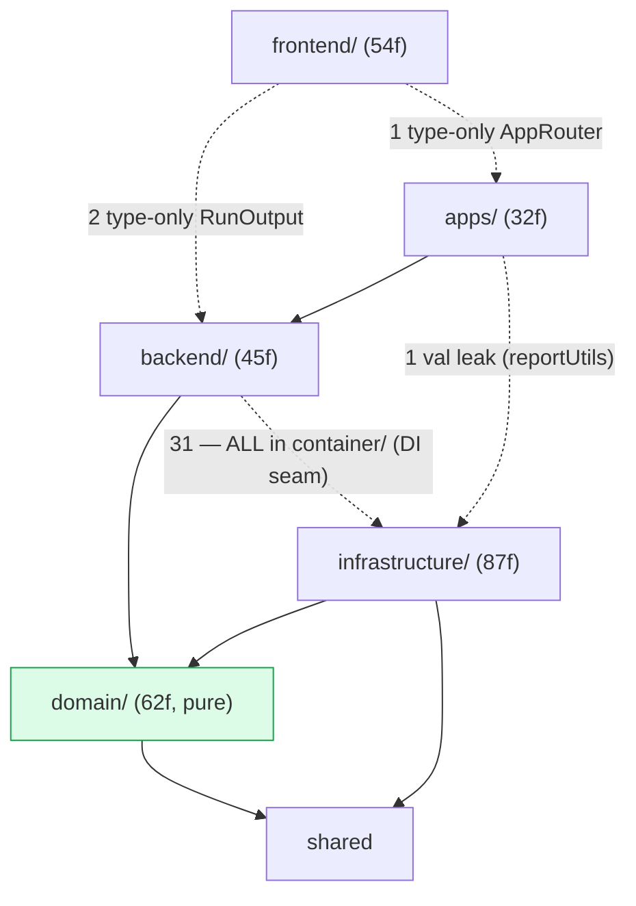
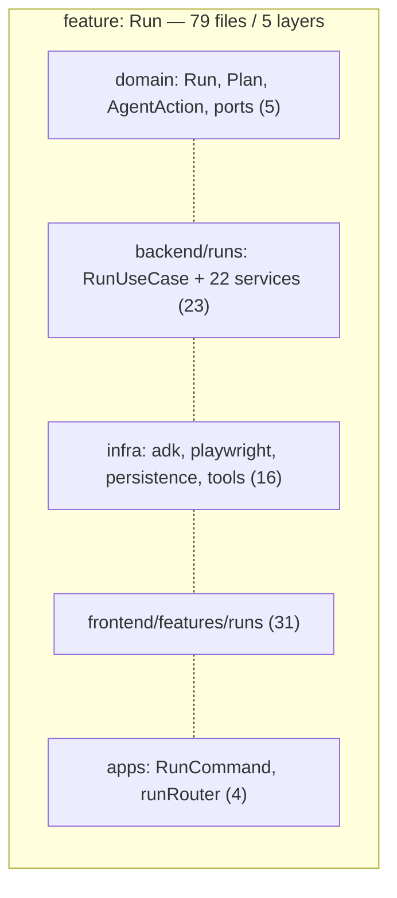
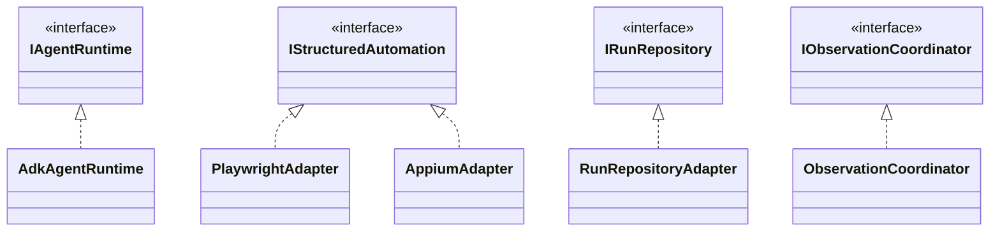

# Domia — Architecture Audit (measured signals)

> Living audit. Numbers are **measured** (`find`/`wc`/`knip`/import-graph), not estimated.
> Regenerate with the commands noted per section. Source = `src` layers excluding `*.test.ts`.
> Whole-repo signals here; **per-subsystem** audit (apps, agents/ADK, persistence/history, CLI, logging, testing) in `subsystems.md`; tools/plugins/ADK wiring in `tool-system.md`.

## 1. Size & shape (measured)

| Layer | files | LOC | avg LOC/file |
|---|--:|--:|--:|
| domain | 62 | 1667 | 26 |
| backend | 45 | 3075 | 68 |
| infrastructure | 92 | 7054 | 76 |
| frontend | 57 | 4281 | 75 |
| shared | 18 | 539 | 29 |
| apps | 33 | 2490 | 75 |
| **total** | **307** | **19106** | **62** |

Folder depth (dirs from root): depth-2 = 194 files, depth-3 = 49, depth-4 = 33, depth-5 = 11. Max depth 5. Shallow — not a nesting problem.

## 2. Dead code (measured)

`npx knip` → **0 unused files, 0 unused exports, 0 unused deps**. No `console.*` outside CLI, no `any`, no TODO/FIXME/HACK markers in src. **Dead-code ≈ 0%.** This is genuinely clean; not the problem.

## 3. God files (measured: src > 250 LOC)

| LOC | file | verdict |
|--:|---|---|
| 387 | `infrastructure/playwright/PlaywrightAdapter.ts` | cohesive — ~25 thin `resolveRef().andThen()` action methods + launch/lifecycle over mutable `page`. Tab mgmt now extracted to `PlaywrightTabs`. Remainder is the irreducible `IStructuredAutomation` surface; further splitting adds delegation tax, not clarity. |
| 275 | `infrastructure/agent-runtime/adk/AdkAgentRuntime.ts` | the ADK run loop + `prepareRunContext`. Event-mapping, metrics, artifact-sink, conversation-compaction and tool-dep assembly (`assembleToolDependencies`) all already extracted; what's left is the orchestration spine. |

**Signal: 0 genuine god files.** Only 2 files exceed 250 LOC and both are length-from-cohesion, not god-objects. The previously-flagged ElectronDriver (now 205), RunForm (145) and SQLiteWorkflowRepository (179) have been split below threshold; RunCommand (203) split into `run/renderRunStream` + `run/promptForMissingRunInputs`.

## 4. Coupling (measured: import graph)

Cross-layer import matrix (row imports col; counts of `@alias` imports):

| from\to | domain | backend | infra | frontend | shared | apps |
|---|--:|--:|--:|--:|--:|--:|
| domain | 36 | · | · | · | 3 | · |
| backend | 153 | 63 | **31** | · | 14 | · |
| infrastructure | 243 | · | 17 | · | 38 | · |
| frontend | 25 | **2** | · | 83 | 4 | **1** |
| shared | · | · | · | · | 3 | · |
| apps | 21 | 48 | **1** | · | 13 | · |

Boundary verdict (verified by grep, not matrix alone):
- **backend→infra = 31, ALL inside `backend/container/`** (the sanctioned DI seam). Non-container backend→infra = **0**. ✅ clean.
- **domain → only domain+shared.** ✅ pure.
- **frontend→backend = 2**: `import type { RunOutput } from '@backend/dto'` (store + useRunPanel). Type-only (erased at runtime). Inherent to a typed run-stream UI, but **un-guarded** by `check-architecture` (its `frontend-boundary` rule forbids only `@infrastructure`).
- **frontend→apps = 1**: `import type { AppRouter }` in `api/trpc.ts`. Type-only — the standard typed-tRPC client pattern. Acceptable but un-guarded.
- **apps→infra = 0**: the former `reportUtils.ts → ReportWriterService` value import is gone — it now resolves the `IRunReportWriter` port via the container. ✅ leak closed.

**Circular dependencies = 0 (gated).** A `madge` sweep once found **5 cycles** (type-only back-edges: a low-level module importing a type from the high-level module that imports it at runtime — `IPersistenceAdapter↔IRunRepository/IWorkflowRepository`, `ElectronDriver↔electronCdpConnect`, `platformRegistry↔Web/ElectronPlatformFields`). All broken by relocating the shared type downward/neutral. `check-architecture.mjs` now builds the resolved import graph and DFS-detects cycles every run — they cannot regress.

Top fan-out (most imports in one file): `ContainerBuilder` 67 (composition root, expected), `AdkAgentRuntime` 32, `RunUseCase` 26 (14 ctor deps + types), `RunResumeService` 20.

Top fan-in (most-imported): `@domain/ports` **60**, `@domain/value-objects` 40, `@shared/defaults` 40, `@domain/enums` 32, `@domain/errors` 30. The former 32-file flat `@domain/ports` barrel is now grouped into 7 concern subfolders (`agent/ automation/ perception/ persistence/ reporting/ plugins/ platform/`); the barrel re-exports them so the fan-in is unchanged but navigation no longer hits a flat 32-file wall.

**Layer separation is real and fully enforced.** The "overlap" the team feels is NOT runtime layer bleed — it is the *organization* (next section) + 2 type-only un-guarded boundaries (frontend→backend/apps DTO+router types).

## 5. The actual problem — layer-first, not feature-first (measured)

Files per feature per layer:

| feature | domain | backend | infra | frontend | apps | **layers spanned** |
|---|--:|--:|--:|--:|--:|:--:|
| Run | 5 | 23 | 16 | 31 | 4 | **5** |
| Workflow | 5 | 7 | 2 | 5 | 3 | **5** |
| Skill | 4 | 3 | 3 | 1 | 2 | **5** |
| Plugin | 3 | 1 | 6 | 1 | 2 | **5** |
| Prompt | 1 | 1 | 2 | 3 | 1 | **5** |
| Platform | 1 | 4 | 0 | 5 | 1 | 4 |
| Observation | 5 | 3 | 6 | 0 | 0 | 3 |

**Every non-trivial feature is smeared across all 5 layer folders.** To change "Run" an engineer touches `domain/`, `backend/runs/`, `infrastructure/{playwright,agent-runtime,persistence,tools}/`, `frontend/features/runs/`, `apps/{cli,desktop}/` — 79 files in 5 top-level trees. This is the real "hard to work in" + "no clean per-feature" signal. **Confirmed, not assumption.**

## 6. Abstractions vs implementations (measured)

- Abstractions: **32 domain port files** (`domain/ports/I*.ts`, interfaces only) + 69 files with an exported interface/type.
- Implementations: **95 classes** (`export class` / `@injectable`).
- Separation **by layer is clean**: ports live in `domain/ports`, impls in `infrastructure`. ✅
- **10 infra files mix a local interface + impl in one file** (`ToolSpec.ts`, `DatabaseSchema.ts`, `adkEventMapping.ts`, `ElectronWindowManager.ts`, …) — mostly local helper types, low severity.

## 7. High-level vs utility (measured)

7 class/service files also export a free function (mild mixing): `RunPlanCoordinator`, `HtmlReportGenerator`, `PlaywrightAdapter`, `ShellExecutor` (2), `SQLiteRunRepository`, `SkillRunnerService`, `ReplayLlm` — each 1–2 helpers. Low severity; no shared "utils dumping ground". Cross-cutting helpers already live in `shared/reliability`, `frontend/lib`. **Not a real problem.**

## 8. UML

### 8.1 Layers (measured edges; · = none, ✓ = type-only)

### 8.2 Feature smear (the problem)

Same shape for Workflow, Skill, Plugin, Prompt. **No folder anywhere named for a feature holds its vertical slice** (except partial `backend/<context>/` + `frontend/features/<f>/`).

### 8.3 Ports & adapters (abstractions/impls — clean by layer)

32 ports, each realized in infra. Swap-by-folder works. **This is healthy.**

## 9. Verdict & priorities

**Healthy:** 0% dead code, pure domain, real DI seam, ports/adapters, 0 circular deps (now CI-gated), CI-enforced boundaries.

**Real issues (measured, ranked):**
1. **Layer-first organization** (§5) — every feature spans 5 trees. Biggest "hard to work in" driver. Fix = vertical feature slices; large migration weighed in `feature-first-migration.md` (deferred — net-negative vs the clean base until team-scale justifies it). OPEN / decision-gated.
2. ~~3 god files (ElectronDriver, RunForm, SQLiteWorkflowRepository)~~ — **DONE**: split into hook/mapper/transport modules; no genuine god file remains (PlaywrightAdapter/RunCommand/AdkAgentRuntime are cohesive/already-split).
3. ~~`@domain/ports` flat barrel: 32 files, fan-in 60~~ — **DONE**: grouped into 7 concern subfolders (agent/automation/perception/persistence/reporting/plugins/platform); barrel re-exports preserve consumers.
4. ~~Boundary-guard gaps~~ — **DONE**: `check-architecture` now also enforces `infrastructure-boundary`, `apps-boundary`, and `frontend→@backend/@apps` (only `@backend/dto` + tRPC router type allowed); `reportUtils` routes through the `IRunReportWriter` port.
5. **Minor (OPEN)**: 10 infra files mix a local interface+impl; 7 files mix a free fn with a class. Low severity.

## 10. Next / roadmap

- **Agentic roadmap slices 17–19** remain — the path to the meta-agent loop (per the agentic-roadmap memory). Building blocks staged: `meta.tools.ts`, `ObservationCoordinator.sample`.
- **Feature-first migration** — deferred; execute via `feature-first-migration.md` phases (P0 = split `@domain/ports` by context) only when >3 engineers hit merge contention on layer folders.
- **Last-completed history** lives in `git log` (the per-iteration `refactor(...)` / `fix(...)` commits), not a tracked changelog.
- `/refactor-status` summarizes this section.
