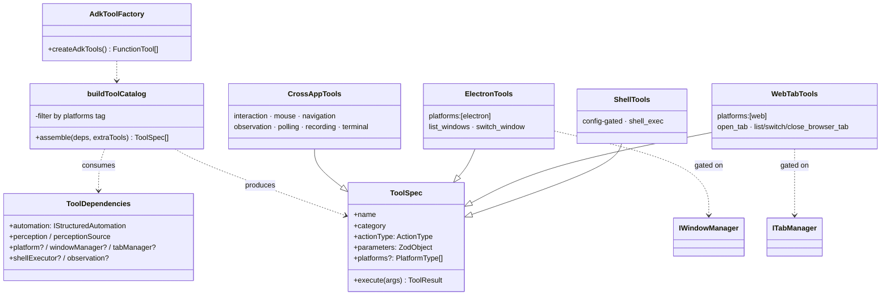
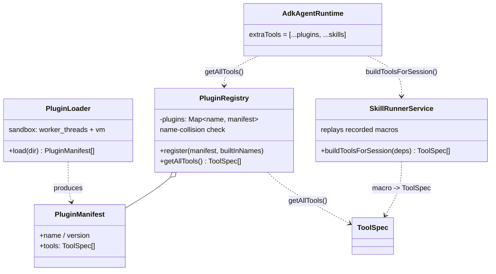
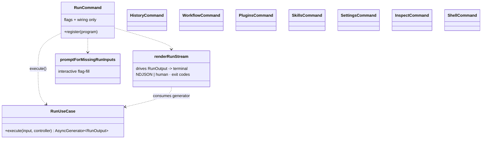
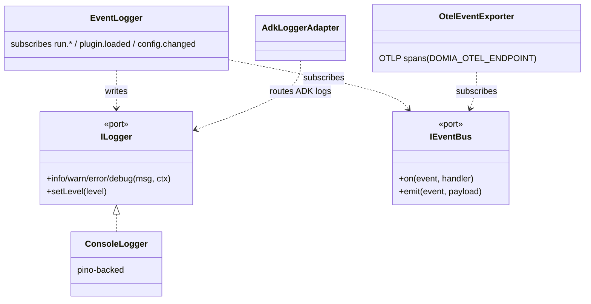
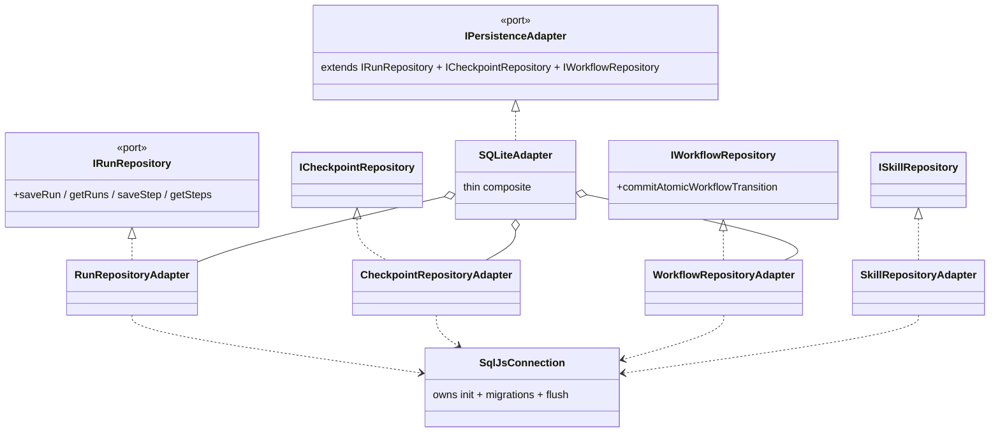
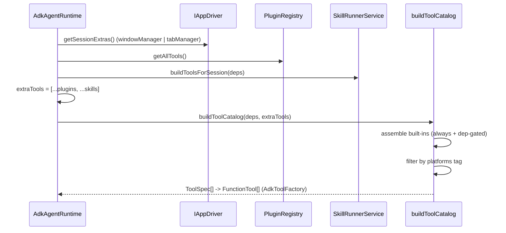

# System Design — Apps, Tools, Plugins, CLI, Logging/Testing, Persistence

> The class/relationship view of the six subsystems + the per-subsystem size map + how to extend each. Whole-repo metrics live in `audit.md`; the layer-first→feature-first decision in `feature-first-migration.md`; how-to/principles in `../ARCHITECTURE.md`.

Spine: one DI container (`backend/container/ContainerBuilder.ts`, 9 phases) wires every adapter under a domain port. Ports grouped: `domain/ports/{agent,automation,perception,persistence,reporting,plugins,platform}/`.

## Subsystem size map (measured)

| Subsystem | Path | Files | LOC |
|---|---|---:|---:|
| Multi-app drivers | `infrastructure/drivers` | 4 | 173 |
| Playwright (web+electron) | `infrastructure/playwright` | 15 | 1637 |
| Appium (mobile) | `infrastructure/appium` | 4 | 331 |
| Agent runtime / ADK | `infrastructure/agent-runtime` | 13 | 853 |
| Tools | `infrastructure/tools` | 15 | 1317 |
| Plugins | `infrastructure/plugins` | 5 | 384 |
| Skills | `infrastructure/skills` | 1 | 137 |
| Persistence / history | `infrastructure/persistence` | 16 | 1145 |
| Observability / logging | `infrastructure/observability` (+ `ConsoleLogger`) | 2 | 95 |
| CLI | `apps/cli` | 19 | 1677 |
| Desktop (Electron) | `apps/desktop` | 13 | 744 |
| Run orchestration | `backend/runs` | 20 | 1347 |
| Workflow orchestration | `backend/workflows` | 7 | 701 |
| Platform negotiation | `backend/platform` | 4 | 213 |

---

## 1. Supported apps — web / electron / mobile

Each target platform is an `IAppDriver` built by an `IAppDriverProvider`, dispatched by `AppDriverFactory` on `platform`. The action surface is one port, `IStructuredAutomation`.

```mermaid
classDiagram
    class IAppDriver {
        <<port>>
        +connect(config) ResultAsync
        +getCapabilities() AppCapabilities
        +getAutomation() IStructuredAutomation
        +getSessionExtras() AgentRuntimeExtras
        +createObservationSampler(deps) IObservationSampler
        +createObservationStream() IObservationStream
    }
    class IAppDriverProvider {
        <<port>>
        +platform: PlatformType
        +createDriver(config) IAppDriver
    }
    class IAppDriverFactory {
        <<port>>
        +registerProvider(p)
        +createDriver(config) IAppDriver
    }
    class IStructuredAutomation {
        <<port>>
        +navigateTo(url) / click / type / hover
        +mouseClick(x,y,btn) / scroll / extractText
    }

    class AppDriverFactory {
        -providers: Map~platform, provider~
    }
    class WebDriver {
        platform = web
        DOM✓ vision✓ multiWin✗ native✗
        getSessionExtras() = { tabManager }
    }
    class ElectronDriver {
        platform = electron
        DOM✓ vision✓ multiWin✓ native✓
        getSessionExtras() = { windowManager }
    }
    class MobileAppDriver {
        platform = mobile
        DOM✗ vision✓ multiWin✗ native✓
        getSessionExtras() = none
    }
    class PlaywrightAdapter {
        facade over the active page
        delegates to PlaywrightTabs / Mouse / Interaction
    }
    class AppiumAdapter

    IAppDriverFactory <|.. AppDriverFactory
    IAppDriverProvider <|.. WebDriverProvider
    IAppDriverProvider <|.. ElectronDriverProvider
    IAppDriverProvider <|.. MobileDriverProvider
    AppDriverFactory o-- IAppDriverProvider : registers
    WebDriverProvider ..> WebDriver : creates
    ElectronDriverProvider ..> ElectronDriver : creates
    MobileDriverProvider ..> MobileAppDriver : creates
    IAppDriver <|.. WebDriver
    IAppDriver <|.. ElectronDriver
    IAppDriver <|.. MobileAppDriver
    IStructuredAutomation <|.. PlaywrightAdapter
    IStructuredAutomation <|.. AppiumAdapter
    WebDriver o-- PlaywrightAdapter
    ElectronDriver o-- PlaywrightAdapter : over CDP
    MobileAppDriver o-- AppiumAdapter
```

| Platform | Provider → Driver | Automation | DOM | vision | multi-window | native | session-extras |
|---|---|---|:-:|:-:|:-:|:-:|---|
| web | `WebDriverProvider` → `WebDriver` | `PlaywrightAdapter` (chromium.launch / BrowserPool) | ✅ | ✅ | ❌ | ❌ | `{ tabManager }` |
| electron | `ElectronDriverProvider` → `ElectronDriver` | `PlaywrightAdapter` over CDP (`electronCdpConnect`) | ✅ | ✅ | ✅ | ✅ | `{ windowManager }` |
| mobile | `MobileDriverProvider` → `MobileAppDriver` | `AppiumAdapter` | ❌ | ✅ | ❌ | ✅ | — |

> Add a platform = add one provider + register in `ContainerBuilder.registerPlatform()`. Zero changes to tools or the agent loop — the catalog reacts to the driver's capabilities/extras.

---

## 2. Tools — common (cross-app) vs per-app

Every tool — built-in, plugin, or skill — is one `ToolSpec`. `buildToolCatalog` assembles them; the optional `platforms` tag + dependency gating decide which reach a session. `AdkToolFactory` binds `ToolSpec → FunctionTool`.



| Group | File | `platforms` tag | reaches |
|---|---|---|---|
| interaction | `interaction.tools.ts` | — | **all apps** |
| mouse | `mouse.tools.ts` | — | **all apps** |
| navigation | `navigation.tools.ts` | — | **all apps** |
| observation | `observation.tools.ts` | — | **all apps** |
| polling | `polling.tools.ts` | — | **all apps** |
| snapshot-recording | `snapshot-recording.tools.ts` | — | **all apps** |
| terminal (`finish`/`suspend`) | `terminal.tools.ts` | — | **all apps** |
| shell (`shell_exec`) | `shell.tools.ts` | — | all (config-gated) |
| **windows** (`list/switch_window`) | `electron.tools.ts` | `['electron']` | **electron only** |
| **tabs** (`open/list/switch/close_tab`) | `tab.tools.ts` | `['web']` | **web only** |
| meta (`list_categories`…) | `meta.tools.ts` | — | staged, not wired (roadmap slice 12) |

**Two filters** decide membership: (1) dependency gating — electron/tab/shell factories return `[]` if `windowManager`/`tabManager`/`shellExecutor` absent; (2) `platforms` tag — `buildToolCatalog` drops a tagged tool unless the active platform matches.

---

## 3. Plugins (+ skills) — extend every session

Third-party `ToolSpec`s loaded in a `worker_threads` + `vm` sandbox, merged into **every** session. Skills are recorded macros replayed as tools through `IStructuredAutomation`.



`AdkAgentRuntime.run()`: `extraTools = [...pluginRegistry.getAllTools(), ...skillTools]` → `createAdkTools(toolDeps, extraTools)`. Plugin tools carry no platform tag by default (author may add one); skills are cross-app by construction (fail per-step if a platform can't honor an action).

---

## 4. CLI (and its desktop twin)

Both entry points are thin shells over the **same DI container** and the **same `AsyncGenerator<RunOutput>`** — CLI iterates it, desktop tRPC subscribes to it.



**8 root commands** (`apps/cli/index.ts`): `run`, `history`, `workflow`, `settings`, `inspect`, `plugins`, `skills`, `shell`. `run/` submodules: `renderRunStream`, `promptForMissingRunInputs`, `logLevel`, `interactiveControls`, `replay`, `resume`. Desktop mirrors run/history/workflow/settings/plugins/skills as tRPC routers over the identical stream.

---

## 5. Logging & testing

**Logging** — two channels off domain ports: direct `ILogger` (pino) + domain events via `IEventBus`, bridged by `EventLogger`; OTLP export opt-in.



**Tracing dashboard (opt-in):** `OtelEventExporter` is registered + installed but inert until `DOMIA_OTEL_ENDPOINT` is set. For a local view: `docker compose -f docker-compose.observability.yml up -d`, `export DOMIA_OTEL_ENDPOINT=http://localhost:4318/v1/traces`, run any entry point, then open Jaeger at `http://localhost:16686` (service `domia`).

**Testing** — e2e only, real DB/browser/plugin-loader; **only the LLM is replayed** (`ReplayLlm`). `vitest` serial (`fileParallelism: false`):

| area | files | exercises |
|---|--:|---|
| observation | 7 | perception/observation sampling + streaming |
| tools | 5 | tool catalog + **tab management** (new) against fixtures |
| persistence | 4 | SQLite migrations + repos |
| runs | 4 | run lifecycle + suspend/resume |
| workflow | 3 | orchestrator + atomic transitions |
| agent | 2 | full runs (replay LLM + Playwright) |
| plugins | 1 | sandbox loader |

Determinism: `LlmReplay` (recorded Gemini), `tempDb` (in-memory); live-LLM gated behind `DOMIA_LIVE_LLM=1`. Assertions on outcomes (DB row / event stream / report file), never internal calls.

---

## 6. Database & persistence

ISP: one shared `SqlJsConnection` (init + migrations + flush) + per-aggregate repository adapters, composed by the thin `SQLiteAdapter`. Storage = SQLite via sql.js. Ports live in `domain/ports/persistence/`.



**Tables**: `runs`, `checkpoints`, `workflows`, `skills`. **History** = read path on the run repo (`RunQueries → RunRepositoryAdapter → SqlJsConnection`), surfaced by CLI `history` + desktop `historyRouter`. Atomic workflow transitions isolated in `workflowAtomicTransition.ts`. Swap DB = replace `infrastructure/persistence/` (one `IPersistenceAdapter` boundary).

---

## Cross-cutting summary

| Subsystem | Key port(s) | Swap unit | Diagram |
|---|---|---|---|
| Apps (web/electron/mobile) | `IAppDriver` + `IStructuredAutomation` | add a provider | §1 |
| Tools (common/per-app) | `ToolSpec` + `ToolDependencies` | a `catalog/*.tools.ts` | §2 |
| Plugins / skills | `IPluginRegistry` + `ISkillPlayback` | the sandbox loader | §3 |
| CLI / desktop | shared `AsyncGenerator<RunOutput>` | n/a (one stream) | §4 |
| Logging / testing | `ILogger` + `IEventBus` / replay seam | the pino adapter / `ReplayLlm` | §5 |
| Database / persistence | `IPersistenceAdapter` + per-aggregate repos | `persistence/` folder | §6 |

---

## Tool registration — how a tool reaches a session

`AdkAgentRuntime.run()` assembles every session's toolset from three sources, then two filters decide membership:



**Two independent filters** (belt-and-suspenders):
1. **Dependency gating** — `OPTIONAL_TOOL_FACTORIES` return `[]` when their dep is absent. `windowManager` comes *only* from `ElectronDriver.getSessionExtras()`, `tabManager` *only* from `WebDriver.getSessionExtras()` (the `PlaywrightTabs`), `shellExecutor` only when shell config is enabled — so off-platform tools are never even constructed.
2. **`platforms` tag** — `buildToolCatalog` drops a tagged spec unless `deps.platform` is in its list. Electron/tab tools carry both safeguards.

## Extending each subsystem

- **New platform** → implement `IAppDriver` + `IAppDriverProvider` in `infrastructure/<platform>/`; register in `ContainerBuilder.registerPlatform()`; add the schema in `shared/contracts/platform.ts`. No tool/loop changes.
- **Cross-app tool** → add to `catalog/<area>.tools.ts` with a Zod schema + `ActionType`; thread any new dep through `ToolDependencies`. Leave `platforms` absent.
- **App-specific tool** → same, plus `platforms: ['<platform>']` and gate its factory on the driver-supplied dep in `OPTIONAL_TOOL_FACTORIES`.
- **Plugin** → ship a `PluginManifest` of `ToolSpec`s; `PluginRegistry` merges them into every session (collision-checked).
- **LLM provider** → implement `IAgentRuntime` in `agent-runtime/<provider>/`; register under the `'IAgentRuntime'` token. `ToolSpec`/`buildToolCatalog` are runtime-agnostic.
- **New aggregate / table** → port in `domain/ports/persistence/`, adapter in `infrastructure/persistence/` behind `SqlJsConnection`, composed into `SQLiteAdapter`.
