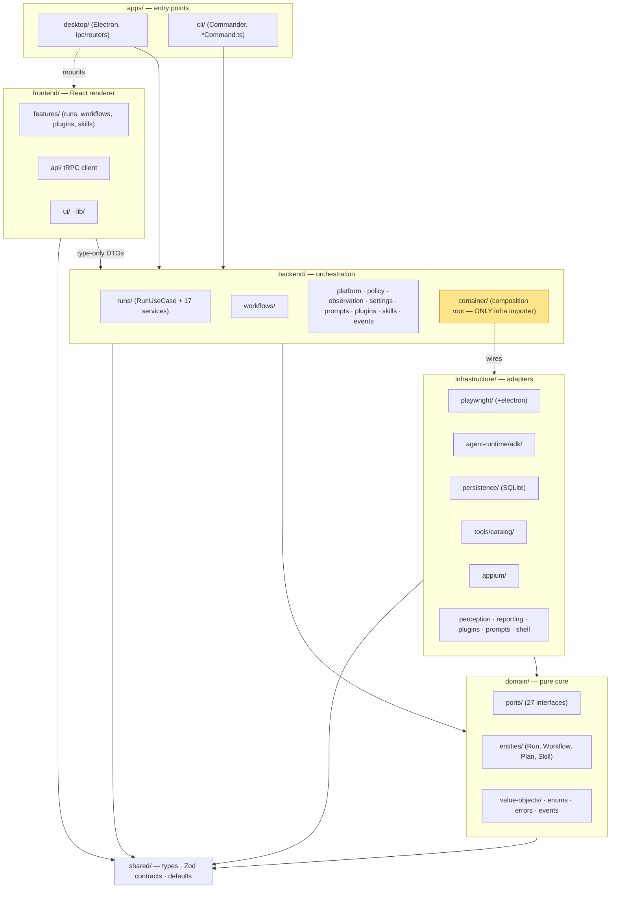
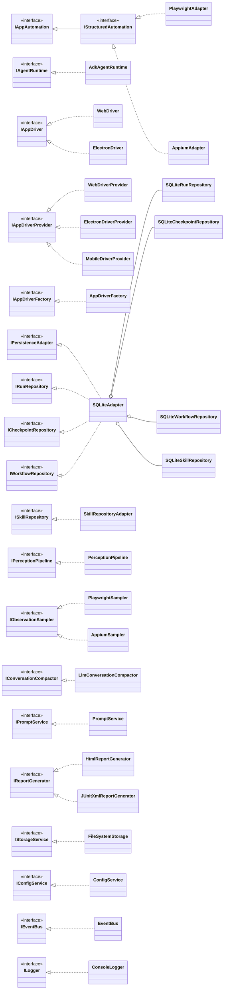
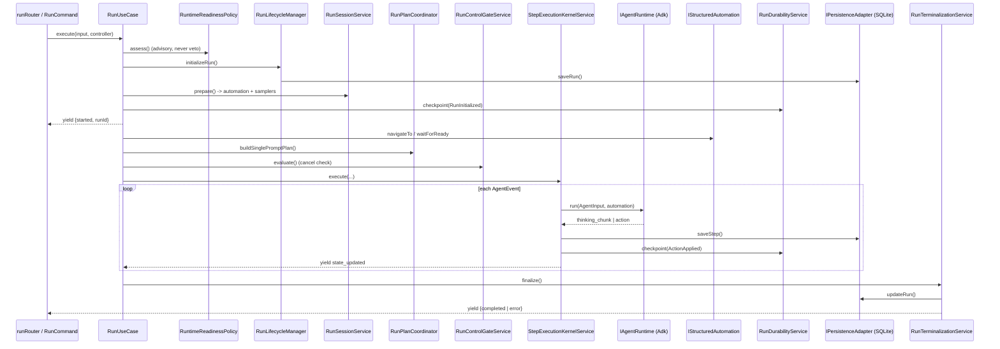
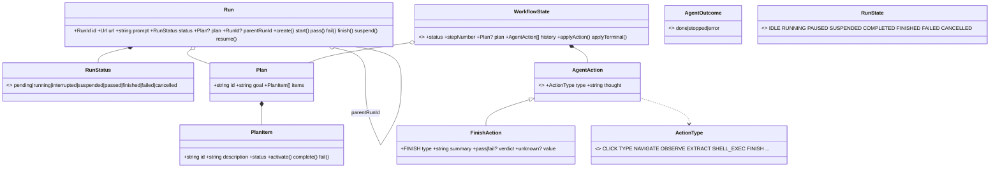
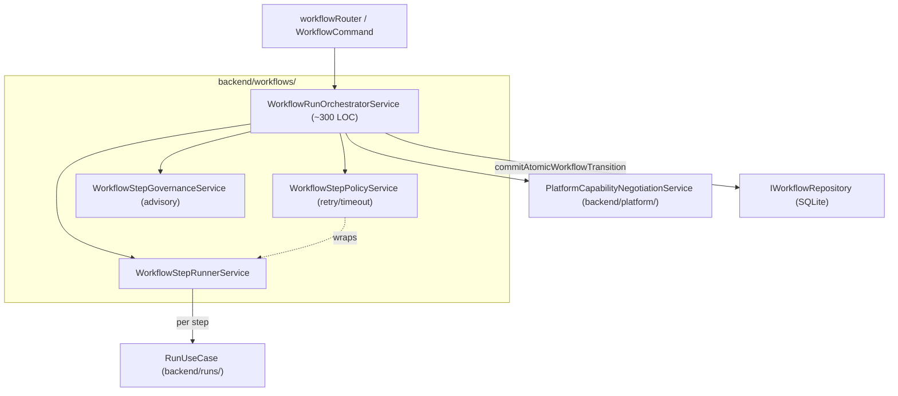

# Domia — Structure Audit & Metrics (2026-05-29)

> Snapshot taken on branch `consolidation` at the start of the consolidation effort.
> Purpose: collect metrics and signals to drive a structural improvement pass.
> Method: a structural survey (verified `find`/`wc` numbers) plus four parallel
> read-only investigations (stale docs, dead code via `knip`, structure metrics, UML).
> Numbers in this doc are computed, not estimated; where a tool produced noisy output
> it is flagged inline.

---

## 1. Headline metrics

| Metric | Value |
|---|---|
| TS/TSX source files | **309** |
| Total TS/TSX LOC | **~23,400** |
| Markdown files | 34 (was 39 before this audit removed `.agent/`) |
| Largest layer | `infrastructure/` — 82 files / 6,869 LOC |
| Files over the 300-LOC guideline | **10** |
| Max directory depth (from repo root) | 5 dirs deep (`frontend/features/runs/components/platform/`) |
| Modal directory depth | 2–3 dirs deep |
| Confirmed dead-code clusters | 1 (`RunRecoveryService` + `recoverOrphanedRuns`) |
| `knip` default run | clean (0 unused files / exports / deps) |

> Note on depth: an automated pass reported "depth 8–11" — that counted the absolute
> filesystem prefix (`/Users/brahim/Projects/Domia/…`). Measured from the repo root the
> deepest path is 5 directories.

---

## 2. Per-layer & per-subfolder breakdown

| Layer | Files | LOC | Avg LOC/file |
|---|---|---|---|
| infrastructure | 82 | 6,869 | 84 |
| tests | 37 | 4,666 | 126 |
| frontend | 44 | 4,217 | 96 |
| backend | 43 | 3,096 | 72 |
| apps | 24 | 2,356 | 98 |
| domain | 59 | 1,604 | 27 |
| shared | 18 | 537 | 30 |

**infrastructure/** (the heavyweight):

| Subfolder | Files | LOC | Note |
|---|---|---|---|
| playwright | 13 | 1,592 | adapter-heavy; `PlaywrightAdapter.ts` is 415 LOC |
| tools | 15 | 1,315 | god-folder (tool catalog) |
| persistence | 10 | 1,063 | SQLite facade + 4 repos |
| agent-runtime | 11 | 811 | `adk/` single-child chain; `AdkAgentRuntime.ts` 412 LOC |
| plugins | 5 | 384 | |
| appium | 4 | 331 | `NOT_IMPLEMENTED` stub |
| remainder | 24 | ~373 | many thin/single-file folders |

**backend/**:

| Subfolder | Files | LOC | Note |
|---|---|---|---|
| runs | 19 | 1,344 | god-folder; 17 narrow services orchestrated by `RunUseCase` |
| workflows | 6 | 733 | orchestrator carries persistence inline (asymmetric with runs) |
| platform | 4 | 211 | |
| container | 1 | 217 | composition root, 64 imports |
| remainder | 13 | ~591 | 7 single-file folders (`events/`, `policy/`, `settings/`, `prompts/`, `plugins/`…) |

**frontend/**:

| Subfolder | Files | LOC | Note |
|---|---|---|---|
| features/runs | 22 | 2,823 | god-folder; `StepInspector.tsx` 497, `WorkflowWorkspace.tsx` 347, `PromptEditor.tsx` 321 |
| features/workflows | 3 | 661 | |
| ui | 7 | 233 | reusable components |
| lib | 6 | 128 | |
| remainder | 6 | ~372 | |

**domain/**:

| Subfolder | Files | LOC | Note |
|---|---|---|---|
| ports | 29 | 555 | god-folder; 27 port interfaces, flat |
| value-objects | 18 | 453 | god-folder |
| entities | 4 | 259 | Run, Workflow, Plan, Skill |
| types/events | 4 | ~147 | |

---

## 3. Refactor signals — files over 300 LOC

The project guideline is "consider splitting past ~300 lines." Ten files exceed it:

| File | LOC | Kind |
|---|---|---|
| frontend/features/runs/components/StepInspector.tsx | 497 | React component |
| apps/cli/RunCommand.ts | 471 | CLI command |
| infrastructure/playwright/PlaywrightAdapter.ts | 415 | adapter |
| infrastructure/agent-runtime/adk/AdkAgentRuntime.ts | 412 | runtime |
| apps/cli/WorkflowCommand.ts | 395 | CLI command |
| tests/e2e/cli/helpers/cli-test-helpers.ts | 391 | test helper |
| tests/e2e/persistence/sqlite-persistence.test.ts | 357 | test |
| frontend/features/workflows/components/WorkflowWorkspace.tsx | 347 | React component |
| frontend/features/runs/components/PromptEditor.tsx | 321 | React component |
| tests/e2e/tools/recording-and-polling.test.ts | 309 | test |

---

## 4. Structural smells

**God-folders (>15 files):**
- `domain/ports/` (29) — flat interface explosion; split by context (agent / automation / persistence / perception / reporting).
- `frontend/features/runs/` (22) — split into sub-features (editor / inspector / workspace / activity).
- `backend/runs/` (19) — cohesive but large; resume/replay/health/reporting could form sub-namespaces.
- `domain/value-objects/` (18) — review whether some are entities mis-filed.
- `infrastructure/tools/catalog/` (15) — tool-by-tool sprawl.

**Single-child folder chains (unnecessary nesting):**
`infrastructure/agent/ → common/`, `infrastructure/agent-runtime/ → adk/`, `infrastructure/perception/ → sensors/`, `infrastructure/tools/ → catalog/`. Each adds a traversal level without branching.

**Single-file folders (~10):** `backend/{events,plugins,prompts,policy,settings}/`, `frontend/api/` (4 LOC), `infrastructure/{llm,skills,services}/`. Candidates for flattening or merging.

**Duplicated folder names across layers:** `prompts/` exists at top-level, `backend/prompts/`, and `infrastructure/prompts/` — ambiguous ownership. Same pattern for `plugins/` (3 layers) and `runs/` (backend + frontend).

**Barrels:** ~85 `index.ts` files; many re-export 1–2 symbols (unnecessary indirection). Frontend uses none; domain/shared use a few load-bearing ones.

---

## 5. Coupling signals

**Fan-in hotspots (most-imported):** `@domain/ports` (64), `@domain/value-objects` (58), `@domain/enums` (36), `@shared/defaults` (30), `@domain/errors` (25). The domain surface is the shared contract — expected, but brittle to churn.

**Fan-out hotspots (most imports):**

| File | Imports | Note |
|---|---|---|
| backend/container/ContainerBuilder.ts | 64 | composition root — expected |
| infrastructure/agent-runtime/adk/AdkAgentRuntime.ts | 34 | core runtime, 412 LOC |
| backend/runs/RunUseCase.ts | 25 | orchestrator, 14 constructor deps |
| infrastructure/persistence/SQLiteAdapter.ts | 22 | multi-port facade |

No import cycles detected — the layered/hexagonal direction holds.

---

## 6. Dead-code findings

`knip` (run via its existing `knip.json`) is **clean** on the default config: 0 unused files, exports, or dependencies. Prior refactor sweeps already removed the loop guard, budget veto, `AutoProfileSelectorPlugin`, and platform stubs — grep confirms no leftover references.

**The one genuine dead cluster** (built, DI-registered, but never wired to a caller):

| Symbol | Location | Status |
|---|---|---|
| `recoverOrphanedRuns()` | backend/container-root.ts:22 | exported, **0 callers** |
| `RunRecoveryService` (class + file) | backend/runs/RunRecoveryService.ts | only reachable via the dead function |
| container registration | backend/container/ContainerBuilder.ts:61,112 | dead (registers the unused service) |
| `RunStatus` `interrupted` variant | domain/entities/Run.ts | only *producer* is the dead service; no consumer |
| `MAIN_DIST` export | apps/desktop/main.ts:23 | declared, never read |

> **Contradiction to resolve:** the refactor-tracker (Track 4e) states this service is
> "invoked at startup via `recoverOrphanedRuns()`." It is not. So this is a **wire-it or
> delete-it** decision, not an automatic deletion.

Ruled-out false positives (verified wired via DI / IPC / CLI, NOT dead): `RunSuspensionService`, `RunResumeService`, `RunReplayService`, `RunReportingService`, `RunHealthMonitorService`, all `Skill*` services, `AppiumAdapter`/`MobileDriverProvider` (intentional stub), every `domain/value-objects/index.ts` re-export, all 6 config schemas in `shared/contracts/config.ts`.

---

## 7. Stale documentation & config

**Deleted in this audit:** `.agent/` (5 legacy workflow `.md` files describing a removed `src/`-prefixed architecture, an `@google/generative-ai` LLM stack, and mock-based testing — all superseded by `.claude/` and contradicted by current `CLAUDE.md`; referenced by nothing).

**Needs fixing, not deleting (lagging-but-authoritative or broken):**

| Artifact | Problem |
|---|---|
| docs/architecture/refactor-tracker.md | accurate through Apr-27 Phase 3; slices 11–16 (budget-veto removal, advisory governance, `set_observation_profile`, truncation) landed since and are unrecorded |
| docs/architecture/target-design.md | module map still uses obsolete `src/presentation/*`, `src/application/*` paths |
| README.md | cites `GEMINI_API_KEY` (code uses `GOOGLE_API_KEY`); documents `readiness:gate` / `release:check` scripts that don't exist; links a missing `LICENSE` |
| .eslintrc.cjs | `import/no-restricted-paths` zones all target deleted `./src/*` dirs → `npm run lint` enforces no boundaries (real guard is `scripts/check-architecture.mjs`) |
| .github/workflows/ci.yml | calls nonexistent `npm run test:integration`, uses pruned `--coverage`, never runs `check:architecture` or `test:cli` → effectively broken |
| knip.json | orphaned: `knip` is not a devDependency, yet `.claude/commands/check.md` + `.claude/settings.json` invoke `npx knip` |
| .vscode/extensions.json | recommends `Vue.volar` in a React project |
| electron-builder.yml | references `public/icon.png` + `build/` resources that don't exist (latent packaging break) |

**Security note:** `.env` holds a live `GOOGLE_API_KEY` in plaintext. Correctly gitignored/untracked, but consider rotating.

---

## 8. UML / class-design view

> Names verified against source. Arrows in the package diagram point toward the dependency.

### 8.1 Layered package diagram

The dependency rule is inverted at the boundary: `infrastructure/` implements `domain/` ports; `backend/` depends only on `domain/`+`shared/`. The single sanctioned crossing is `backend/container/` (highlighted), which wires adapters to port tokens. `apps/` reach `backend/` only through the DI container.

### 8.2 Ports & adapters (core of the design)

Textbook ports-and-adapters: 27 domain ports, each realized in `infrastructure/`. Swap `playwright/` to change browser automation; swap `agent-runtime/adk/` to change LLM provider.

**Design smells:**
- `SQLiteAdapter` is a multi-port facade bound to `IPersistenceAdapter`, `IRunRepository`, `ICheckpointRepository`, `IWorkflowRepository` simultaneously. It delegates to four real repos that are *not* registered as ports — so the interface-segregation split is notional, not wired.
- Two `ISkillRepository` impls (`SQLiteSkillRepository` + `SkillRepositoryAdapter`, the latter wrapping the former) — confirm the indirection is load-bearing.
- Several single-implementation ports (`IConfigService`, `ITabManager` folded into `PlaywrightAdapter`) are abstractions created for a single use — the premature-port smell `CLAUDE.md` warns against.

### 8.3 The agent run pipeline

`RunUseCase` is a pure orchestrator — no business logic, just sequencing across ~12 injected single-responsibility services. The whole run is one `AsyncGenerator<RunOutput>` consumed identically by the tRPC subscription and the CLI loop. Readiness is advisory (logs, never blocks); the budget check is the remaining hard gate (`BudgetExceededError`).

**Smells:** `RunUseCase` injects 14 deps (wide fan-in that grows per stage); `ObservationCoordinator` is `new`'d inline rather than DI-resolved.

### 8.4 Domain model

Entities are immutable interfaces with companion const objects of pure transition functions; string sets are typed-const; only 3 real `enum`s. A verdict-less `finish` is a first-class outcome.

**Smells:**
- `RunStatus` (8-state union, persisted lifecycle) and `RunState` (8-value enum, controller signal bus) overlap but are different types — two vocabularies for "what a run is doing."
- `Run` transition methods `throw` instead of returning `Result` — inconsistent with the cross-boundary `Result` discipline.
- `ActionType` has ~36 values but `AgentAction` has ~27 variants — several enum members (`WAIT_FOR_URL`, `RECALL_RECENT`, `SET_OBSERVATION_PROFILE`, `SUSPEND`…) have no union variant. Reconcile.

### 8.5 Workflows bounded context

A workflow is a sequenced list of typed steps (`AgentWorkflowStep | ForEachWorkflowStep`) over a shared browser session opened once and reused. `WorkflowRunOrchestratorService` is the workflow analogue of `RunUseCase`; each agent step is a full single run bound back via `WorkflowStepRunRecord.runId`.

**Smells:** Asymmetric with `runs/` — the orchestrator carries persistence/lifecycle inline (no `WorkflowLifecycleManager` equivalent to `RunLifecycleManager`/`RunTerminalizationService`). Two governance gates (`WorkflowStepGovernanceService` advisory + `PlatformCapabilityNegotiationService` blocking) are invoked inline, splitting the "should this step run" decision across two contexts.

---

## 9. Prioritized signals for the structure improvement

1. **Decide the `RunRecoveryService` cluster** (wire at startup, or delete) — resolves the one dead-code cluster + the tracker contradiction.
2. **Split the two run god-folders** — `frontend/features/runs/` (22 files) into sub-features and the 3 oversized components; `backend/runs/` (19) into resume/replay/observability sub-namespaces.
3. **Make persistence ISP real** — bind the four `SQLite*Repository` classes to their ports instead of one `SQLiteAdapter` singleton answering all tokens.
4. **Split `domain/ports/`** (29 flat interfaces) by context.
5. **Flatten single-child chains** in `infrastructure/` (`agent-runtime/adk`, `tools/catalog`, `perception/sensors`, `agent/common`) and merge single-file backend folders.
6. **Fix the broken dev tooling** (§7): repair `ci.yml`, point `.eslintrc.cjs` zones at real dirs or drop them, decide knip in-or-out, fix the README env-var/script drift.
7. **Reconcile `ActionType` ↔ `AgentAction`** and the `RunStatus`/`RunState` dual vocabulary.
8. **Bring docs current** — append slices 11–16 to the refactor-tracker; fix `target-design.md` paths.
9. **Reduce barrel indirection** — drop `index.ts` files re-exporting 1–2 symbols.
10. **Split the 10 files over 300 LOC** (§3) where they aren't already cohesive.
