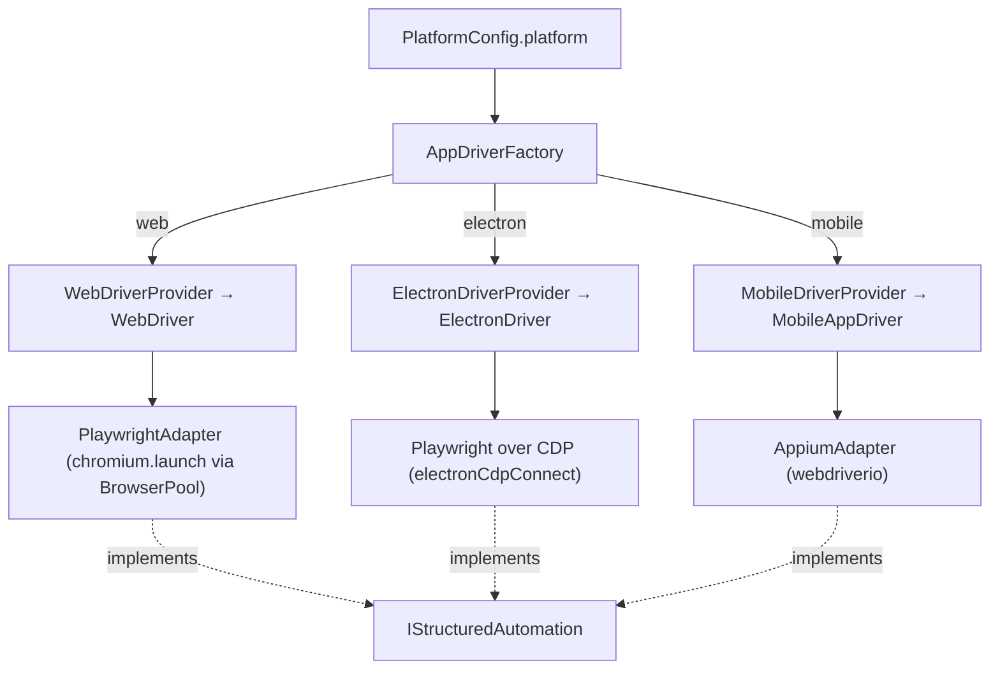
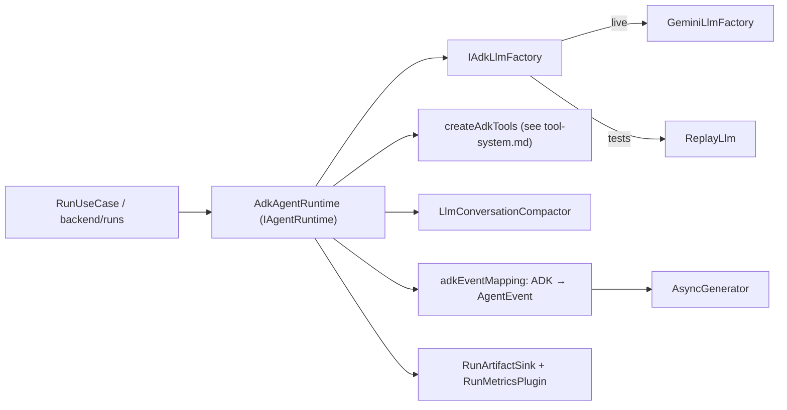
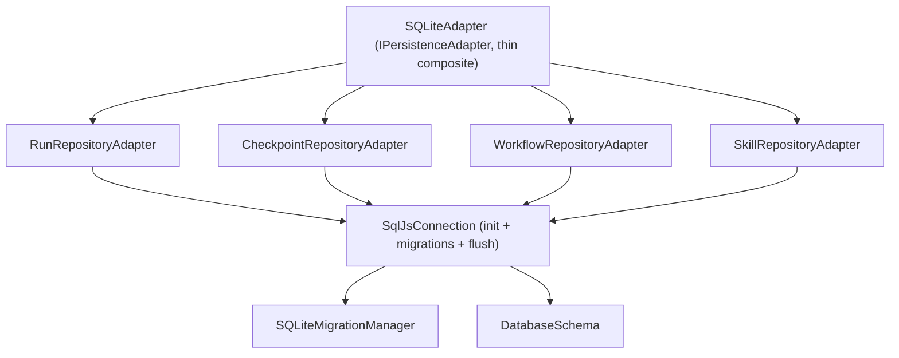
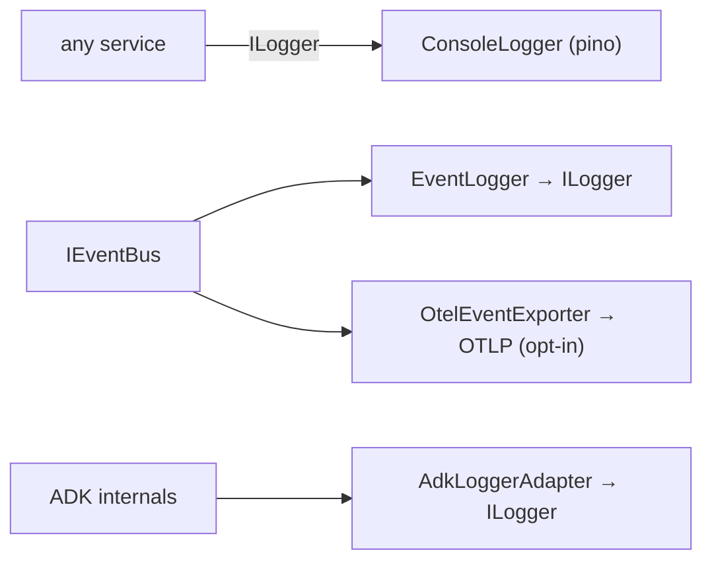
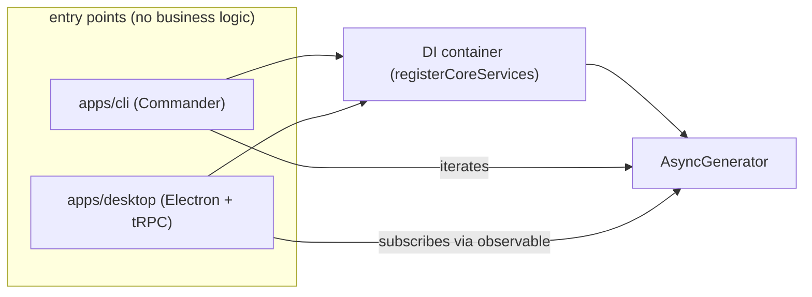

# Subsystem Audit — apps, agents/ADK, tools, plugins, persistence/history, CLI, logging, testing

> Companion to `docs/architecture/audit.md` (whole-repo signals: size, coupling, god-files, UML).
> This doc audits **per subsystem** — measured signals + the abstraction map for each.
> Tools/plugins/ADK-wiring deep-dive lives in `docs/architecture/tool-system.md`; this doc summarizes and links.

Measured 2026-05-31 on branch `support-electron-apps`.

## Subsystem size map (measured)

| Subsystem | Path | Files | LOC | Audited in |
|---|---|---:|---:|---|
| Multi-app drivers | `infrastructure/drivers` | 4 | 173 | §1 |
| Playwright (web+electron) | `infrastructure/playwright` | 14 | 1598 | §1 |
| Appium (mobile) | `infrastructure/appium` | 4 | 331 | §1 |
| Agent runtime / ADK | `infrastructure/agent-runtime` | 12 | 831 | §2 |
| Tools | `infrastructure/tools` | 15 | 1317 | §3 → tool-system.md |
| Plugins | `infrastructure/plugins` | 5 | 384 | §3 → tool-system.md |
| Skills | `infrastructure/skills` | 1 | 137 | §3 → tool-system.md |
| Persistence / history | `infrastructure/persistence` | 16 | 1145 | §4 |
| Observability / logging | `infrastructure/observability` (+ `ConsoleLogger`) | 2 | 95 | §5 |
| CLI | `apps/cli` | 19 | 1677 | §6 |
| Desktop (Electron app) | `apps/desktop` | 13 | 744 | §6 |
| Run orchestration | `backend/runs` | 20 | 1347 | §2 |
| Workflow orchestration | `backend/workflows` | 7 | 701 | §2 |
| Platform negotiation | `backend/platform` | 4 | 213 | §1 |

Everything is wired through one composition root — `backend/container/ContainerBuilder.ts` — in nine phases:

```
registerCore → registerPlatform → registerRuntime → registerWorkflow
→ registerLlm → registerPerception → registerObservability
→ registerUseCases → registerReporting
```

---

## 1. Multi-app support (web / electron / mobile)

**Abstraction:** every target app is an `IAppDriver` produced by an `IAppDriverProvider`, dispatched by `AppDriverFactory` on `platform`. The action surface is the single port `IStructuredAutomation`.



| Driver | Platform | DOM | vision | multi-window | native | sessionExtras |
|---|---|:-:|:-:|:-:|:-:|---|
| `WebDriver` | web | ✅ | ✅ | ❌ | ❌ | tabManager (via `newTab` on automation) |
| `ElectronDriver` | electron | ✅ | ✅ | ✅ | ✅ | `{ windowManager }` |
| `MobileAppDriver` | mobile | ❌ | ✅ | ❌ | ✅ | — |

- All three registered in `ContainerBuilder.registerPlatform()`.
- **Web** is the most mature (1598 LOC, AriaSensor/RoleRef/SmartScroll perception). **Electron** reuses Playwright over CDP + adds window management. **Mobile/Appium** is the thinnest (331 LOC) — real adapter, DOM-less, vision-only.
- Capability mismatches are caught *before* a workflow step runs by `PlatformCapabilityNegotiationService` (`backend/platform/`) — a static `platform × capability` support matrix flagging `degraded`/`blocked`.

**Signal:** mobile is functional but shallow vs web — expected; the abstraction holds (adding a platform = one provider, zero catalog change).

---

## 2. Agents & ADK runtime

**Abstraction:** `IAgentRuntime` (domain port) — one method `run(input, automation): AsyncGenerator<AgentEvent, AgentOutcome>`. The only implementation is `AdkAgentRuntime` (Google ADK + Gemini). Swapping LLM stacks = replace `agent-runtime/adk/` only.



- **LLM seam:** `IAdkLlmFactory` token → `GeminiLlmFactory` in prod, `ReplayLlm` in tests (deterministic replay from `tests/fixtures/llm-recordings`).
- **Event translation:** `adkEventMapping.ts` converts ADK callbacks into the domain `AgentEvent` union, streamed as an `AsyncGenerator` — the same seam the CLI iterates and the desktop subscribes to.
- **Context management:** `LlmConversationCompactor` + `buildCompactionCallback` keep the conversation under budget; `snapshotConversation`/`restoreConversation` enable suspend/resume.
- **Run orchestration** (`backend/runs`, 1347 LOC, 20 files) is the largest backend context — narrow services (lifecycle, durability, suspension, resume, budget, session, terminalization, plan-coordinator, control-gate, kernel, readiness, health) over `RunUseCase`. Per CLAUDE.md trap #3, new run responsibilities = new service here, not growth of `RunUseCase`.
- **Terminal tool** is `finish` with optional verdict; verdict-less is legitimate (no pass/fail-required, no loop guard — deleted Phase 4.1).

**Signal:** single-runtime port is clean; ADK is fully contained. Biggest mass is run-lifecycle services — already decomposed, not god-classes.

---

## 3. Tools, plugins, skills

Full deep-dive: **`docs/architecture/tool-system.md`**. Summary:

- **Built-in catalog** (`infrastructure/tools/catalog/*`) — cross-app tools (interaction/mouse/nav/observe/poll/record/terminal, untagged) + app-specific (`electron.tools` `platforms:['electron']`, `tab.tools` `platforms:['web']`) + config-gated `shell`.
- **Plugins** (`PluginRegistry.getAllTools()`) — merged into every session, sandboxed via `worker_threads` + `vm`; name-collision-checked.
- **Skills** (`SkillRunnerService`) — recorded macros replayed as tools via `IStructuredAutomation`.
- **Registration** — all normalized to `ToolSpec`, assembled by `buildToolCatalog`, bound to ADK by `AdkToolFactory` (`ToolSpec → FunctionTool`).
- `meta.tools.ts` (6 tools) staged + tested, **not wired**.

---

## 4. Persistence & run history

**Abstraction:** `IPersistenceAdapter` (composite) over per-aggregate repository ports. Storage is SQLite via sql.js/Kysely. Replace `infrastructure/persistence/` = swap DB.



- **ISP applied:** `SqlJsConnection` owns init/ready/flush; each aggregate has its own adapter + raw `SQLite*Repository`. `SQLiteAdapter` is a thin composite (recreated after the earlier god-file split).
- **History** is a read path on the run repository: `getRuns(limit)` → surfaced by CLI `history list/show` (`apps/cli/HistoryCommand.ts`) and the desktop history view. Run rows + checkpoints + reports are the durable, user-visible record.
- Atomic workflow transitions isolated in `workflowAtomicTransition.ts` + `workflowRowMappers.ts`.

**Signal:** clean per-aggregate split; no god-repository. 1145 LOC across 16 files = small files, one concern each.

---

## 5. Logging & observability

Two distinct concerns, both off the domain ports:

| Concern | Port / class | Notes |
|---|---|---|
| **Structured logging** | `ILogger` → `ConsoleLogger` (pino-backed) | `info/warn/error/debug` + `setLevel`. Injected everywhere. No `console.log` in source (CLI commands excepted). |
| **Event logging** | `EventLogger` (subscribes to `IEventBus`) | Turns domain events into log lines. |
| **Tracing export** | `OtelEventExporter` | OpenTelemetry spans from the event bus, opt-in via `DOMIA_OTEL_ENDPOINT`. |
| **ADK bridge** | `AdkLoggerAdapter` | Routes ADK's internal logging through `ILogger`. |



**Signal:** logging is small (95 LOC) and correctly abstracted — one port, one pino adapter, event/trace fan-out via the bus. No scattered `console.*`.

---

## 6. CLI & desktop entry points

Both apps are thin shells over the same DI container and the same `AsyncGenerator<RunOutput>` stream (CLAUDE.md: apps contain no business logic).

**CLI** (`apps/cli`, 1677 LOC, Commander) — one file per top-level command:

| Command | File |
|---|---|
| `run` | `RunCommand.ts` (+ `run/` submodules: logLevel, interactiveControls, replay, resume) |
| `workflow` | `WorkflowCommand.ts` (+ `workflow/` submodules: steps-file, definition, run, execution) |
| `history` | `HistoryCommand.ts` |
| `inspect` | `InspectCommand.ts` |
| `plugins` | `PluginsCommand.ts` |
| `skills` | `SkillsCommand.ts` |
| `settings` | `SettingsCommand.ts` |
| `shell` | `ShellCommand.ts` |

**Desktop** (`apps/desktop`, 744 LOC) — Electron `main`/`preload` + tRPC root + per-feature routers; long ops over `observable<T>` subscriptions.



**Signal:** symmetric — anything the desktop does, the CLI does over the identical stream. This is the boundary test for `apps/server` later.

---

## 7. Testing

**Policy** (`tests/CLAUDE.md`): e2e only, no mocked unit tests. Real DB, real browser, real plugin loader; only the **LLM** is mocked (replay).

**Measured: 25 `.test.ts` files** across:

| Area | Files | What |
|---|---:|---|
| `observation` | 7 | perception/observation sampling + streaming |
| `persistence` | 4 | SQLite migrations + repositories |
| `runs` | 4 | full run lifecycle + persistence |
| `tools` | 4 | tool catalog against fixture pages |
| `workflow` | 3 | orchestrator with real persistence |
| `agent` | 2 | full agent runs (Gemini replay + Playwright) |
| `plugins` | 1 | plugin loader (incl. bad/escape fixtures) |

- **Determinism:** `LlmReplay` (`tests/support/llmReplay.ts`) replays recorded Gemini responses; `tempDb.ts` gives in-memory DBs. Live LLM tests gated behind `DOMIA_LIVE_LLM=1`.
- **Serial execution:** `vitest.config.ts` sets `fileParallelism: false` (e2e share real browser/DB — parallel was flaky).
- **Fixtures:** static HTML pages, recorded LLM responses, sample/bad/escape plugins, a fixture Electron app.

**Signals / gaps:**
- ⚠️ `tests/e2e/cli/` holds fixtures + helpers but **0 `.test.ts`** — CLI behavior is exercised indirectly (subprocess helpers exist, scenarios not landed). `tests/CLAUDE.md` still claims subprocess CLI scenarios — **stale**, should be corrected.
- ⚠️ No `desktop`/IPC test area — desktop is covered only through shared backend services.
- ✅ Strongest coverage where risk is highest (observation, persistence, runs).

---

## 8. Verdict

| Subsystem | State |
|---|---|
| Multi-app drivers | ✅ clean abstraction; mobile shallow but functional |
| Agents / ADK | ✅ fully contained behind one port; run-services decomposed |
| Tools / plugins / skills | ✅ uniform `ToolSpec`; see tool-system.md |
| Persistence / history | ✅ per-aggregate ISP, no god-repo |
| Logging / observability | ✅ small, one port, bus fan-out |
| CLI / desktop | ✅ symmetric thin shells over one stream |
| Testing | ⚠️ solid e2e core; **CLI tests absent**, desktop untested, `tests/CLAUDE.md` stale on CLI |

**One actionable gap:** land CLI subprocess tests (helpers already exist) and fix the stale `tests/CLAUDE.md` claim. Everything else is structurally sound.
