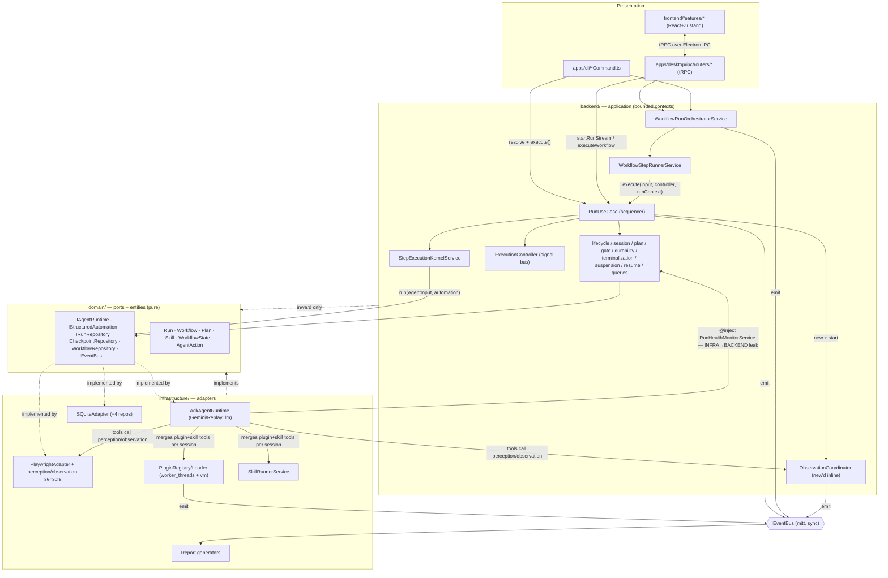
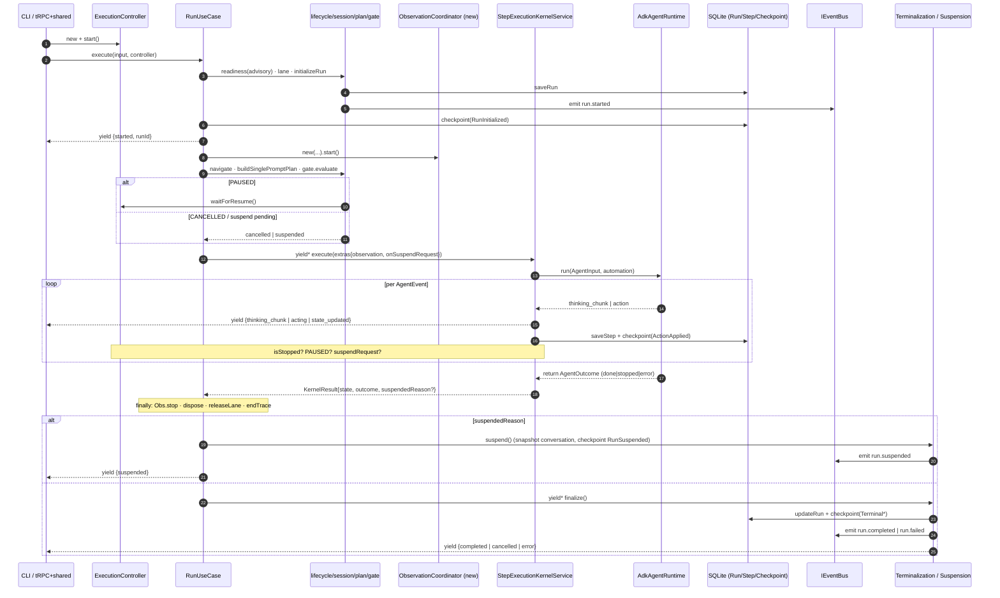
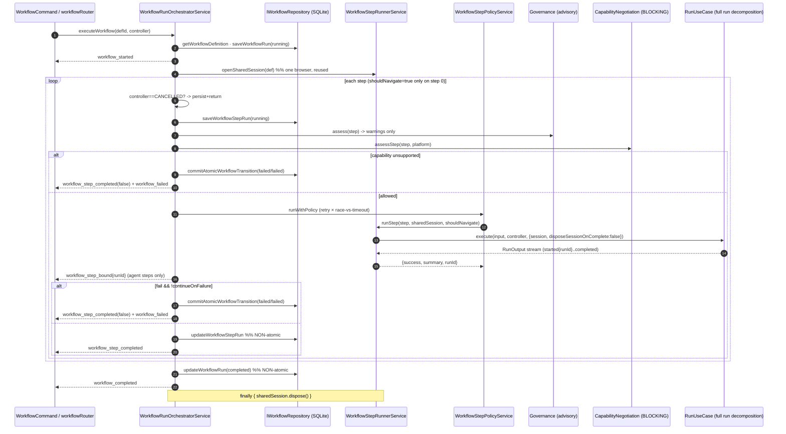
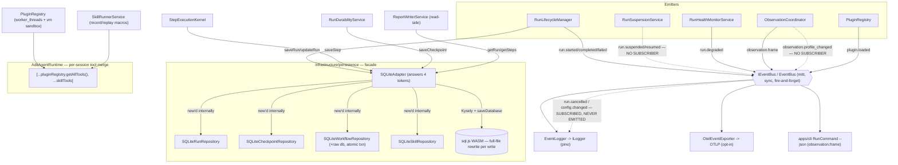

<!-- Generated by multi-agent workflow (10 agents) on 2026-05-29. Builds on structure-audit-2026-05-29.md. -->

# Domia — Architecture Synthesis: System Interaction & Layer Design

*Synthesis of five system maps + three assessments, re-verified against source on branch `meta-agent-loop`. Builds on `docs/architecture/structure-audit-2026-05-29.md`; metrics not re-derived. Read-only.*

---

## 1. Executive verdict

**(A) How the systems interact.** Domia is a single hexagonal application exposed through two presentation surfaces (Electron/tRPC and a Commander CLI) that both resolve the same DI container and consume the **same `AsyncGenerator<RunOutput>`** returned by `RunUseCase.execute()` — this shared generator seam is the architectural high point of the system. A *run* is an LLM reason-act loop: `RunUseCase` (a pure sequencer over ~14 narrow services) delegates the inner loop to `StepExecutionKernelService`, which pumps `IAgentRuntime.run()` (the ADK/Gemini adapter), persisting each step and checkpoint to one SQLite store and honoring pause/cancel/suspend signals carried on a shared `ExecutionController`. A *workflow* is a thin layer above runs: `WorkflowRunOrchestratorService` opens one shared browser session and sequences N full runs through it, each an independently-persisted `Run` back-linked by `runId`. Perception (synchronous, pull, per-action) and observation (ambient, push/sample, between-action) are two distinct subsystems that both feed the agent's tools; persistence, a synchronous event bus, worker-isolated plugins, record/replay skills, and post-hoc reporting are supporting subsystems that plug in at well-defined points.

**(B) Is it clean feature-based architecture with ≥4 well-separated layers?** Domia comfortably **clears the ≥4-layer bar** — five distinct tiers (domain → backend/application → infrastructure/adapters → presentation, plus `shared` as a leaf kernel) with an inward-only dependency rule, no import cycles, and a real dependency-inversion seam at `backend/container/`. But it is **layer-first, not feature-first**: only `backend/` (and the `apps/` router/command seam) is genuinely feature-sliced, while `domain/`, `infrastructure/`, and `shared/` are organized by artifact-type / technology / role, so every non-trivial feature is scattered across 5–6 layer folders. The user's stated target — "clean architecture *per feature*" — is therefore **partially met (the backend half) and absent in the other layers**, and a full migration is **not warranted**: targeted sub-namespacing and a handful of altitude fixes capture ~80% of the benefit at ~5% of the cost.

---

## 2. System interaction overview



**Narrative.** Both entry surfaces are thin: a tRPC mutation or a CLI command resolves a backend service from the tsyringe container and drives a generator. The runtime control flow always funnels through `RunUseCase`, which orchestrates narrow services and the kernel; the kernel is the only place that touches `IAgentRuntime`. Adapters in `infrastructure/` implement the domain ports and are wired to tokens in `backend/container/ContainerBuilder.ts`. The single arrow that violates the dependency rule is `AdkAgentRuntime → RunHealthMonitorService` (an `infrastructure → backend` import, verified at `infrastructure/agent-runtime/adk/AdkAgentRuntime.ts:11,69`); see §5. The event bus is a synchronous side-channel for observability and reporting — it does **not** carry the run→UI stream (the generator does that).

---

## 3. Pipelines

### 3.1 The run pipeline (single agent run)

`RunUseCase.execute()` (`backend/runs/RunUseCase.ts`, 203 LOC, 14 ctor deps) is a pure sequencer. It resolves the URL, runs an **advisory** readiness check (warn-only, never blocks), acquires a concurrency lane, initializes the run (`Run.create→start`, `saveRun`, emits `run.started`), prepares a session, checkpoints `RunInitialized`, `new`s an `ObservationCoordinator` and starts it, navigates, builds a single-prompt plan, passes a pre-step control gate, then `yield*`s `StepExecutionKernelService.execute(...)` — the delegated generator streams events straight to the consumer. A `finally` block stops observation, disposes the session, releases the lane, ends the trace, and either suspends or finalizes.

The kernel pumps `IAgentRuntime.run()` (an `AsyncGenerator<AgentEvent, AgentOutcome>`). Per action it saves a step trace, yields `acting`, persists a `Step`, applies the action to the immutable `WorkflowState`, checkpoints `ActionApplied`, then checks cancel / pause / suspend between events. `AdkAgentRuntime` runs one ADK `Runner` per `runId`, maps each Gemini function-call to an `AgentAction`, defers each action's yield by one turn so the metrics plugin can stamp the tool result onto its trace, and terminates on `FINISH` (`{kind:'done'}`) or budget exhaustion.



**Control signals.** `ExecutionController` (`backend/ExecutionController.ts`, `extends EventEmitter`) is the shared signal bus carrying an in-memory `RunState` (IDLE/RUNNING/PAUSED/CANCELLED/…). Pause/cancel/suspend are each checked in **two** places — the pre-step `RunControlGateService.evaluate` and the mid-step inline checks in the kernel — with the same three conditions re-derived per action. Suspend is agent-initiated: the `suspend` tool fires an `onSuspendRequest(reason)` callback → `controller.requestSuspend`; the kernel tears down the ADK generator via `stepGen.return()` and returns `suspendedReason`. Resume re-enters the **same kernel** with a restored `WorkflowState` via `RunResumeService` (a ~130-line near-clone of the `execute` finalize path).

### 3.2 The workflow pipeline (sequenced supervisor of runs)

`WorkflowRunOrchestratorService.executeWorkflow()` (~300 LOC) is a single async generator carrying definition loading, run/step-record CRUD, governance/capability gating, the step loop, summary composition, and session disposal **inline**. It loads a `WorkflowDefinition`, creates a workflow run, opens **one** shared session via `WorkflowStepRunnerService.openSharedSession`, then loops the steps inside a `try { … } finally { sharedSession.dispose() }`.



### 3.3 The run↔workflow boundary (the key reuse mechanism)

`WorkflowStepRunnerService` is the sanctioned cross-context bridge (per `backend/CLAUDE.md`). It calls `runUseCase.execute(input, controller, runContext)` with `runContext = { session: sharedSession, shouldNavigate, disposeSessionOnComplete: false }`. Inside the run, `RunSessionService.prepare` sees a session was handed in, so `ownsSession = false` → the run does **not** dispose the browser; the orchestrator's `finally` disposes it once after all steps. `shouldNavigate` is forced `false` after step 1, so each step lands on the page the previous step left. Each agent step is therefore a **complete, independently-persisted Run** (own `RunRecord`, steps, checkpoints), back-linked only via `WorkflowStepRunRecord.runId`. For-each steps interpolate `{{$item}}`/`{{$index}}` and run one full sub-run per item over the same session.

**The defining structural asymmetry: runs are decomposed; workflows are a god-method.** A workflow is a sequenced supervisor of runs, but it re-implements inline (and partially) the lifecycle / persistence / event-shaping concerns that `runs/` extracted into named services. Concretely:

| Dimension | `runs/` (RunUseCase) | `workflows/` (Orchestrator) |
|---|---|---|
| Orchestrator role | Pure sequencer over ~14 services | Monolithic ~300-LOC generator, concerns inline |
| Lifecycle / terminalization | `RunLifecycleManager` + `RunTerminalizationService` | Inline `saveWorkflowRun`/`updateWorkflowRun` (no manager) |
| Durability / resume | `RunDurabilityService` checkpoints (replayable) | **None** — a crashed workflow cannot resume |
| Atomicity | Per-step checkpoint | `commitAtomicWorkflowTransition` **only on failure paths**; success path is non-atomic |
| Control signals | Gate + suspension; pause/resume/cancel | Top-of-loop `CANCELLED` check only; timeout does **not** cancel the child run |
| Status vocabulary | `RunStatus` (8 states incl. suspended/passed) | `WorkflowRunStatus` (4 states) |
| Decision gates | Readiness (advisory) + budget | Governance (advisory) + capability (the one remaining hard veto, regex-on-prompt) |

---

## 4. Supporting subsystems



- **Persistence.** One `SQLiteAdapter` (sql.js/WASM) is bound to **four** DI tokens — `IPersistenceAdapter`, `IRunRepository`, `ICheckpointRepository`, `IWorkflowRepository` (verified: `ContainerBuilder.ts:76-79`, all `useToken: 'IPersistenceAdapter'`). It internally `new`s four real repos but exposes them only as thin `withReady`/`withPersist` pass-throughs — every write serializes and rewrites the **entire** DB file (O(n) per write). `commitAtomicWorkflowTransition` is the only true transactional path (hand-rolled `BEGIN/COMMIT/ROLLBACK`). This is the write-sink for the whole platform; reporting and skill-extraction read back out of it.
- **Events.** A synchronous `mitt`-backed bus with 14 declared events. It is **half-dead in both directions** (verified): `run.cancelled` and `config.changed` are subscribed by `EventLogger`/`OtelEventExporter`/`RunHealthMonitorService` but **emitted by nobody**; `run.suspended/resumed` and `observation.profile_changed` are emitted but consumed by nobody; `run.state_updated`/`step.persisted`/`agent.outcome` are declared only. The bus is an observability side-channel — the run→UI path is the generator, not the bus.
- **Plugins.** Loaded from disk, manifest-validated (Zod), and run **out-of-process** in `node:worker_threads` with a `vm.createContext` sandbox (two layers of isolation), tool calls RPC'd over `postMessage` with per-call timeouts. `PluginRegistry.register` enforces tool-name uniqueness.
- **Skills.** Record-and-replay macros extracted from finished runs' persisted steps; replayed via a `DISPATCH_TABLE` keyed by `ActionType`. Both plugins and skills enter the agent **identically** — `AdkAgentRuntime` merges `[...pluginRegistry.getAllTools(), ...skillTools]` into every session's tool catalog.
- **Reporting.** Pure read-side: `ReportWriterService` loads run+steps from `IRunRepository` and renders HTML or JUnit XML. Not part of the live loop.

---

## 5. Layer separation verdict

**Verdict: YES — Domia satisfies "≥4 well-separated layers," with named, file-level caveats.** Six physical folders map onto all four classic clean-architecture rings plus a presentation tier (**5 distinct tiers**), the inward-only dependency rule genuinely holds, and there are no import cycles. The separation is load-bearing: you can swap Playwright, ADK/Gemini, or SQLite by replacing one infrastructure sub-folder. But enforcement is **asymmetric** — 4 of 5 inter-layer boundaries are CI-enforced and clean; one (`infrastructure → backend`) is unguarded and actively violated.

| Ring | Domia layer | Evidence |
|---|---|---|
| Entities / Enterprise | `domain/` | imports only `@shared`; grep for other aliases = 0 hits |
| Use-Cases / Application | `backend/` | depends only on `@domain`+`@shared`; only `backend/container/` touches infra |
| Interface Adapters + Frameworks/Drivers | `infrastructure/` (+ `apps/desktop` shell) | port impls; sql.js, ADK, Playwright/CDP, Electron, worker_threads |
| Presentation | `frontend/` + `apps/` | CLI + tRPC share one `AsyncGenerator<RunOutput>` seam |
| (cross-cutting leaf) | `shared/` | pure types/contracts/defaults; high fan-in |

The CI guard (`scripts/check-architecture.mjs`) defines **6 scoped rules** (verified: `^domain/`, `^backend/(?!container/)`, `^frontend/` ×2, `^apps/desktop/ipc/`, `^shared/defaults/`). Critically **there is no `^infrastructure/` scope at all**, so infra's outbound imports are unchecked.

| Crossing | CI-enforced? | Status | Evidence |
|---|---|---|---|
| `domain → outward` | Yes (`domain-purity`) | **CLEAN** | 0 violations |
| `backend → infra/frontend/apps` (except `container/`) | Yes (`backend-boundary`) | **CLEAN** | only `ContainerBuilder.ts` imports infra |
| `backend/container → infra` (DI exception) | Exempt by design | **CLEAN** | `ContainerBuilder.ts:76-81` — the DIP seam |
| `frontend → infra` | Yes (+ no Node builtins) | **CLEAN** | 0 `@infrastructure` hits |
| `frontend → backend/domain-ports` | **Not guarded** | **LEAKY** | `store.ts`/`useRunPanel.ts` import `RunOutput` from `@backend/dto`; `StepInspector.tsx:11-13` imports `StepArtifacts`/`Step`/`StepTrace` from `@domain/ports/*` (server-side shapes, not DTOs) |
| `apps/desktop/ipc → infra/frontend` | Yes (`desktop-ipc-boundary`) | **CLEAN** | scoped, passing |
| `apps/cli → infra` | **Not guarded** | **LEAKY** | `apps/cli/reportUtils.ts` imports `ReportWriterService` from `@infrastructure/reporting` |
| **`infrastructure → backend`** | **NOT guarded at all** | **VIOLATED** | `AdkAgentRuntime.ts:11,69` — concrete `import { RunHealthMonitorService } from '@backend/runs/...'` + `@inject(...)`, contradicting `infrastructure/CLAUDE.md` while CI reports green |

**Bottom line:** the separation is *architecturally real but only ~80% CI-enforced*. The one-line fix that makes the claim fully defensible is to add an `infrastructure-boundary` rule to the guard (forbid `@backend`/`@frontend`/`@apps` under `^infrastructure/`), then invert `RunHealthMonitorService` behind a domain port (or move the perception-latency concern out of the adapter).

Additional separation smells (leaky, not violated): the **notional persistence ISP** (4 tokens → 1 fat adapter); **off-port concrete coupling** inside infra (`AdkAgentRuntime` injects concrete `SkillRunnerService`/`PluginRegistry` to reach `buildToolsForSession`/full `ToolSpec[]` absent from their ports); and the **untyped `extras: Record<string, unknown>` bag** that smuggles `observation`/`onSuspendRequest`/`windowManager` across the `IAgentRuntime` port via string-key + `as` cast (`AdkAgentRuntime.ts:324`), defeating `tsc` exactly at the seam the architecture most wants typed.

---

## 6. Feature vs layer organization

Domia is **layer-first with one feature-aligned layer**. There is no folder anywhere named after a feature that contains that feature's full vertical stack. The mean spread is **~5.3 layer folders per feature** across ~7–15 sub-folders.

- **`backend/` is the only genuinely feature-sliced layer** — all 11 sub-folders are capabilities (`runs/ workflows/ skills/ plugins/ settings/ prompts/ observation/ platform/ policy/ events/ container/`). **`apps/`** mirrors this with one router + one CLI command per context (the cleanest vertical alignment in the repo). **`frontend/features/`** is partially sliced (only `runs/ workflows/ skills/ plugins/` got folders).
- **`domain/` is artifact-type-first** (`entities/ events/ ports/ types/ value-objects/`, all flat — 29 ports and 18 value-objects in two undifferentiated piles). **`infrastructure/` is technology-first** (16 tech folders; `persistence/` is one shared sink for runs+workflows+skills+checkpoints; `tools/catalog/` is split by action-category, not owning feature). **`shared/` is role-first**.

**FEATURE × LAYER matrix** (✓ cohesive home · ~ partial/folded into another feature · ✗ scattered with no home · — absent):

| Feature | domain | backend | infrastructure | frontend | apps |
|---|:--:|:--:|:--:|:--:|:--:|
| Run / agent-run | ✗ | ✓ | ✗ | ~ | ✓ |
| Workflow | ~ | ✓ | ~ | ✓ | ✓ |
| Skills | ~ | ✓ | ~ | ✓ | ✓ |
| Plugins | ~ | ✓ | ✓ | ✓ | ✓ |
| Prompts | ~ | ✓ | ~ | ~ | ~ |
| Settings | ~ | ✓ | ~ | ✗ | ✓ |
| Shell execution | ~ | — | ~ | — | ~ |
| Observation / Perception | ✗ | ~ | ✗ | ~ | — |
| Platform / driver | ~ | ✓ | ✗ | ~ | ~ |
| History | ✗ | ✗ | ✗ | ✗ | ~ |
| Reporting | ~ | ✗ | ✓ | ✗ | ~ |
| Suspend / Resume | ✗ | ~ | ✗ | ✗ | ~ |
| Replay | — | ~ | ✗ | ✗ | ~ |

**The proof of layer-first organization: the cross-cutting capabilities have no home folder anywhere.**
- **History** (`✗✗✗✗~`) — first-class user feature, no `backend/history/` and no `frontend/features/history/`; its backend logic is a lone `RunQueries.ts` inside `runs/`, and 6 UI files (`HistorySidebar`, `StepInspector` 497 LOC, `RunTimelineView`, `RunActivityLog`, `JsonTreeView`, `stepInspectorStore`) are smeared into `features/runs/`.
- **Suspend / Resume** (`✗~✗✗~`) — a behavior threaded through `Run.ts`, four `backend/runs/Run*Service` files, the suspend tool, ADK snapshot logic, and persistence checkpoints, with **no UI affordance** (the store even drops the `suspended` event).
- **Observation / Perception** (`✗~✗~–`) — the most technology-fragmented: **two parallel vocabularies** in the flat domain piles (`IObservationSampler/Stream` + `ObservationFrame/Profile` vs `IPerceptionPipeline/Source/ISensor` + `PerceptionFrame/VisualContext`) and 7 infra tech sub-folders.
- **Reporting** (`~✗✓✗~`) and **Replay** (`–~✗✗~`) likewise have no backend/UI home.

The "feature-sliced" frontend `features/runs/` is itself a 22-file god-folder absorbing History, Settings, Prompts, and Platform UI that lack their own folders.

---

## 7. Target: feature-based clean architecture

### 7.1 One feature, fully sliced (`run`)

```
features/run/
├── domain/                          # pure: no tsyringe, no I/O, no cross-feature import
│   ├── entities/        Run.ts  Plan.ts
│   ├── value-objects/   AgentAction.ts  WorkflowState.ts  AgentOutcome.ts  CheckpointReason.ts  RunStatus.ts
│   ├── ports/           IAgentRuntime.ts (+ TYPED extras)  IRunRepository.ts  ICheckpointRepository.ts
│   └── enums.ts                     # the ActionType subset this feature owns
├── application/                     # depends on ./domain + shared-kernel ports ONLY
│   ├── RunUseCase.ts  StepExecutionKernelService.ts  RunLifecycleManager.ts
│   ├── RunSessionService.ts  RunPlanCoordinator.ts  RunControlGateService.ts
│   ├── RunTerminalizationService.ts  RunDurabilityService.ts  RunExecutionLaneService.ts
│   ├── ExecutionController.ts        # ← backend/ExecutionController.ts
│   ├── resume/   RunResumeService.ts  RunSuspensionService.ts   # the "no home" fix
│   ├── replay/   RunReplayService.ts
│   ├── queries/  RunQueries.ts        # history backend logic
│   └── dto.ts                         # RunInput, RunOutput, serializeRunOutput
├── infrastructure/                  # adapters implementing ./domain/ports
│   ├── agent-runtime/adk/   AdkAgentRuntime.ts  GeminiLlmFactory.ts  ReplayLlm.ts  ActionMapper.ts  …
│   │   └── tools/catalog/   interaction.tools.ts  navigation.tools.ts  terminal.tools.ts  …
│   └── persistence/         SQLiteRunRepository.ts  SQLiteCheckpointRepository.ts   # real ISP
├── presentation/
│   ├── ipc/runRouter.ts   cli/RunCommand.ts
│   └── ui/   RunForm.tsx  RunPanel.tsx  LiveView.tsx  store.ts  useRunPanel.ts  inspector/StepInspector.tsx
├── run.container.ts                 # the feature's DI registrations
└── run.routes.ts                    # contributes runRouter to the root appRouter
```

This generalizes to a sibling per capability under `features/` — and the scattered capabilities (**history, reporting, suspend/resume, replay, observation**) finally get a folder. The four internal layers are real: `domain/` imports nothing; `application/` imports `./domain` + shared-kernel ports; `infrastructure/` imports `./domain/ports` + shared-kernel; `presentation/` imports `application/` DTOs/use-cases.

### 7.2 Shared / cross-cutting

A `shared-kernel/` (not a feature) holds what ≥2 features depend on: `ILogger`, `IEventBus`, `IConfigService`, `IStorageService`, `ITraceService`, `Brand`/`Result`/`errors`, all `shared/contracts` + `shared/defaults`, and the `DomainEvents` map. Cross-feature ports (`IStructuredAutomation`/`IAppDriver` → platform; `IAgentRuntime` → run; the persistence connection + `saveDatabase()` flush) also live in the kernel. The DI root stays a single `composition-root/container.ts` (tsyringe's container is a process-global singleton), but it calls each feature's `*.container.ts`. The `AsyncGenerator<RunOutput>` seam stays in `run/application/dto.ts`, consumed identically by CLI and IPC.

### 7.3 Honest trade-offs vs today's layer-first hexagonal design

**Improves:** cross-cutting capabilities get a home (the one durable win); change locality (touching skills edits one subtree, not 4 layers); deletability (`rm -rf features/x` + drop two lines).

**Gets harder — the dealbreakers:**
- The **CI guard must be rewritten** from a 6-rule flat regex into a per-feature matrix needing two orthogonal rules each: intra-feature altitude *and* **inter-feature isolation with a cross-feature allow-list** (`workflow→run`, `skill→run`, `*→platform`, `*→shared-kernel` are all legitimate). That allow-listed dependency-graph checker is net-new work ~3× the current script.
- **Domain purity weakens.** Today "`domain/` imports nothing outside" is one trivially-enforced scope and a genuine strength. After, it's N scopes with a tempting failure mode of `run/domain` importing `platform/domain` — you must police a `shared-kernel/domain` or recreate a tangle the flat `domain/` never had.
- **DI fragments but doesn't shrink** — registration count is identical; cross-feature singleton tokens still force a kernel-first → features ordering the root must know.
- **Shared-infra singletons fight the cut** — `SQLiteAdapter` is one connection / one `saveDatabase()` flush, and ADK has one process-wide `InMemorySessionService`; per-feature repos would still import a shared `Database`/`persist()`, so persistence ends up half feature-local, half kernel.
- **Tests barely move** — `tests/e2e/{runs,workflow,observation,persistence,tools,…}` is already feature-aligned, but the no-mock e2e tests boot the whole container and cross features by nature, so they'd stay top-level.

### 7.4 Recommendation: refine in place — do NOT migrate

A full migration fixes **zero** of the actual smells the maps surfaced (god-method orchestrator, hollow budget port, inline-`new` `ObservationCoordinator`, untyped `extras`, the `RunResumeService` clone, notional ISP) — all are altitude/coupling bugs that move folders without improving. For a 309-file / ~23K-LOC codebase that already has a clean acyclic dependency graph, a working guard, feature-aligned `backend/`+`apps/`+tests, and a shared generator seam, the cost/benefit is upside-down. Capture the upside cheaply instead:

1. **Sub-namespace the two god-folders** — `backend/runs/{resume,replay,reporting,health,queries}/` and split `frontend/features/runs/` into real `features/{history,settings,prompts}/` (move `HistorySidebar`/`StepInspector`/`SettingsSidebar`/`PromptEditor` out). Gives suspend/resume/replay/history a home with **no** guard/DI/domain-purity change.
2. **Split `domain/ports/` (29 flat) by context** (`ports/{run,automation,persistence,perception,reporting}/`) — one regex tweak, no semantic change.
3. **Make the persistence ISP real** — bind the four `SQLite*Repository` to their ports.

**If you ever migrate** (only if the team grows past ~3 devs and merge contention on layers becomes real): Phase 0 land #2+#3 (prerequisites + standalone wins); Phase 1 write the allow-listed inter-feature checker first, in report-only mode against today's tree; Phase 2 carve out `skill` or `reporting` as a tracer bullet; Phase 3 establish `shared-kernel/` and migrate `run` last (workflow after, since it depends on run).

---

## 8. Prioritized recommendations

1. **Close the `infrastructure → backend` hole.** Add an `infrastructure-boundary` rule to `scripts/check-architecture.mjs` (forbid `@backend`/`@frontend`/`@apps` under `^infrastructure/`), then invert `RunHealthMonitorService` behind a domain port. This is the one boundary that is both unguarded and violated; the fix is ~1 line of guard + one port. *(High value, low effort.)*
2. **Decompose the workflow god-method.** Extract `WorkflowLifecycleManager` / `WorkflowTerminalizationService` / `WorkflowDurabilityService` to mirror `runs/`, making `WorkflowRunOrchestratorService` a pure sequencer. Add per-step checkpoints so a crashed workflow can resume, and make the **success path atomic** (today only failure paths use `commitAtomicWorkflowTransition`).
3. **Type the `extras` bag onto `AgentInput`.** Replace `Record<string, unknown>` + `as` casts with a typed `observation`/`onSuspendRequest`/`windowManager` contract on the `IAgentRuntime` port — restores `tsc` at the layer seam and removes the type-only `@backend/observation` reference from infra.
4. **Make the persistence ISP real and reduce write amplification.** Bind the four `SQLite*Repository` classes to their ports; batch/debounce the per-write `saveDatabase()` full-file flush, and add a concurrency guard for the desktop's multi-sub-run workflows.
5. **Collapse the `RunResumeService` clone** into `RunUseCase` via a shared finalize block so the run finally-path lives in one place.
6. **Wire or delete the dead weight.** Either wire or remove `RunBudgetPolicyService.assess/evaluate` (only `resolveLimits` is used; the real stop is `actionCount >= maxActions` at `AdkAgentRuntime.ts:149`), the `createMetaTools`/`list_categories`/`expand_category` cluster (never imported by `buildToolCatalog`), `RunRecoveryService`, the `ObservationCoordinator.sample()` pull-path (zero callers — `recall_recent` is empty under the default `on-demand` profile), and the never-emitted/never-consumed events. Add the 7 missing `AgentAction` variants (`WAIT_FOR_URL`, `WAIT_FOR_CHANGE`, `RECALL_RECENT`, `LIST_CATEGORIES`, `EXPAND_CATEGORY`, `SET_OBSERVATION_PROFILE`, `SUSPEND`) so the `ActionMapper.map` `as`-cast stops lying (27 union variants vs 47 `ActionType` members, verified).
7. **Sub-namespace the two god-folders and split `domain/ports/` by context** (recommendation §7.4 #1–2) to give the homeless capabilities a home without a migration.
8. **Fix the frontend leaks and unhandled variants.** Move the DTOs the renderer binds to (`RunOutput`, `StepArtifacts`/`Step`/`StepTrace`) into `shared/`; handle `suspended`/`observation` in `useRunStore.handleRunOutput` (today silently dropped, so suspended runs have no UI despite `run.resumeSuspended` existing); split the 497-LOC `StepInspector.tsx`.
