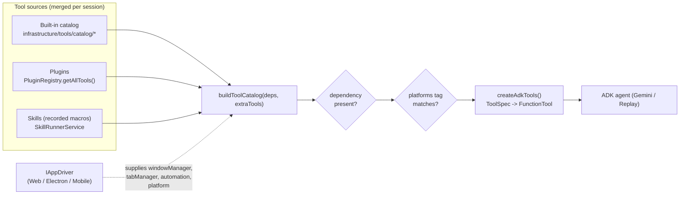
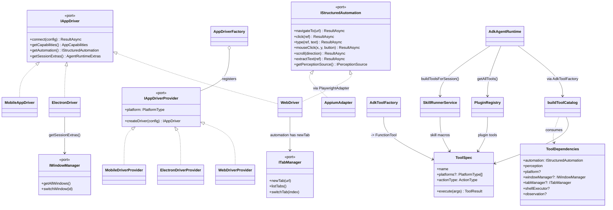
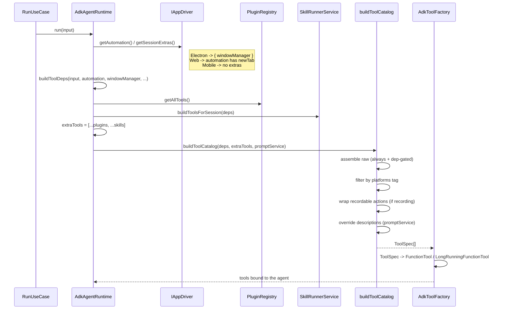
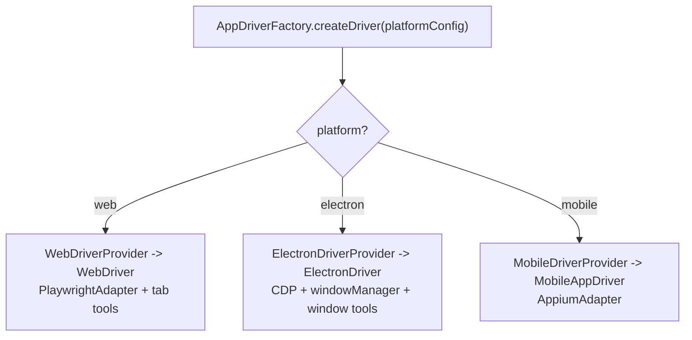
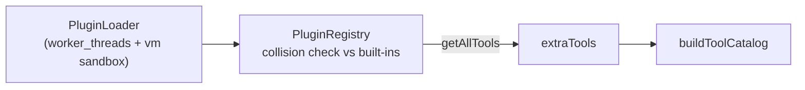

# Tool System — How Tools Are Used Across Apps

> Companion to `docs/ARCHITECTURE.md` and `docs/architecture/audit.md`.
> Answers: *what tools exist, which are shared across platforms, which are platform-specific, how plugins/skills extend the set, and how everything is registered into the ADK agent.*

---

## 1. The question, in one picture



Every tool — built-in, plugin, or skill — is normalized to one shape (`ToolSpec`) and passes through one assembler (`buildToolCatalog`). Two filters decide whether a tool reaches a given session: **is its dependency present**, and **does its `platforms` tag match the active platform**.

---

## 2. The core abstraction stack

Tools sit on top of two domain ports and one infrastructure value type.

| Abstraction | Location | Role |
|---|---|---|
| `IStructuredAutomation` | `domain/ports/IAppAutomation.ts` | The action surface a tool calls — `click`, `type`, `navigateTo`, `mouseClick`, `scroll`, `extractText`, … Every platform implements it. |
| `IAppDriver` | `domain/ports/IAppDriver.ts` | A live session: `connect`, `getCapabilities`, `getAutomation`, `getSessionExtras`, observation factories. |
| `IAppDriverFactory` / `IAppDriverProvider` | `domain/ports/IAppDriverFactory.ts` | Platform dispatch — one provider per platform, registered at boot. |
| `ToolSpec` | `infrastructure/tools/ToolSpec.ts` | The uniform tool shape (see below). |
| `ToolDependencies` | `infrastructure/tools/ToolSpec.ts` | The bag of everything any tool factory might need. |

`ToolSpec` is the contract every tool conforms to, regardless of origin:

```ts
interface ToolSpec {
    name: ToolNameValue;
    category?: ToolCategory;            // interaction | mouse | navigation | observation
                                        // | terminal | polling | recording | shell | electron | meta
    description: string;
    actionType: ActionType;             // domain enum — drives recording + dispatch
    parameters: z.ZodObject;            // validated JSON schema for the LLM
    platforms?: readonly PlatformType[]; // ABSENT = cross-app; present = restricted
    isLongRunning?: boolean;            // -> LongRunningFunctionTool in ADK
    execute(args): Promise<ToolResult> | ToolResult;
}
```

`platforms` absent ⇒ the tool runs on **every** platform. That single optional field is the cross-app vs app-specific switch.

---

## 3. Class view



---

## 4. How tools enter a session (registration)

All assembly happens in `AdkAgentRuntime.run()` → `buildToolDeps()` → `createAdkTools()` → `buildToolCatalog()`.



The merge line in `AdkAgentRuntime`:

```ts
const skillTools = await this.skillRunner.buildToolsForSession(toolDeps);
const extraTools  = [...this.pluginRegistry.getAllTools(), ...skillTools];
const { tools, catalog, captureMiddleware } =
    createAdkTools(toolDeps, extraTools, this.promptService);
```

---

## 5. The catalog — cross-app vs app-specific

`buildToolCatalog` assembles three tiers (`infrastructure/tools/buildToolCatalog.ts`):

### Tier A — always present, **cross-app** (no `platforms` tag)

These call only `IStructuredAutomation`, so they run on web, electron, and mobile alike.

| File | Tools | Category |
|---|---|---|
| `interaction.tools.ts` | `click`, `type`, `hover`, `selectOption`, `dragTo`, `pressKey` | interaction |
| `mouse.tools.ts` | `mouse_move`, `mouse_click_left`, `mouse_click_right`, `mouse_double_click`, `mouse_drag`, `mouse_scroll` | mouse |
| `navigation.tools.ts` | `scroll`, `navigate` | navigation |
| `observation.tools.ts` | `observe`, `extract`, `extract_page_content`, `recall_recent`, `wait`, `set_observation_profile` | observation |
| `polling.tools.ts` | `waitForCondition`, `wait_for_url`, `wait_for_change` | polling |
| `snapshot-recording.tools.ts` | `startRecording`, `stopAndReviewRecording` | recording |
| `terminal.tools.ts` | `finish`, `suspend` | terminal (agent control, not platform) |

### Tier B — dependency-gated (`OPTIONAL_TOOL_FACTORIES`)

Only added when the matching dependency is present in `ToolDependencies`:

| Factory | Gate | Tools | Platform reach |
|---|---|---|---|
| `createShellTools` | `deps.shellExecutor` (config `plugins.shell.enabled`) | `shell_exec` | any platform, when enabled |
| `createElectronTools` | `deps.windowManager` | `list_windows`, `switch_window` | **electron only** (also `platforms:['electron']`) |
| `createTabTools` | `deps.tabManager` | `open_tab`, `list_browser_tabs`, `switch_browser_tab`, `close_browser_tab` | **web only** (also `platforms:['web']`) |

### Tier C — extra tools (plugins + skills), see §7 / §8.

### Two filters, belt-and-suspenders

A tool can be excluded in **two** independent ways:

1. **Dependency gating** — the factory returns `[]` if its dependency is absent. `windowManager` is supplied *only* by `ElectronDriver.getSessionExtras()`; `tabManager` is supplied *only* when the automation exposes `newTab` (web Playwright). So Electron/tab tools never even get constructed off-platform.
2. **`platforms` tag filter** — the final guard in `buildToolCatalog`:

```ts
const platform = deps.platform;
let filtered = raw.filter(
    (spec) => !platform || !spec.platforms?.length || spec.platforms.includes(platform),
);
```

A tool with no `platforms` is universal; a tagged tool is dropped unless the active platform is in its list. Electron and tab tools carry both safeguards.

---

## 6. Drivers & their capabilities

Each platform is one `IAppDriverProvider` registered into `AppDriverFactory` at boot. The driver declares capabilities and may hand back **session extras** that unlock app-specific tools.

| Driver | Platform | automation impl | DOM | vision | multi-window | native | sessionExtras |
|---|---|---|---|---|---|---|---|
| `WebDriver` | `web` | `PlaywrightAdapter` (chromium.launch via BrowserPool) | ✅ | ✅ | ❌ | ❌ | — (tabManager via `newTab` on automation) |
| `ElectronDriver` | `electron` | Playwright over CDP (`electronCdpConnect`) | ✅ | ✅ | ✅ | ✅ | `{ windowManager }` |
| `MobileAppDriver` | `mobile` | `AppiumAdapter` | ❌ | ✅ | ❌ | ✅ | — |



> Adding a platform = add a provider, register it, no change to the catalog. The catalog reacts to whatever dependencies/capabilities the driver supplies.

`PlatformCapabilityNegotiationService` (`backend/platform/`) is a separate, higher-level concern: before a *workflow step* runs it scans the prompt for capability keywords (navigate/extract/app-control/system-control) and checks a static `web/electron/mobile × capability` support matrix to flag steps that are `degraded` or `blocked` on the target platform. It does not build tools — it gates workflow steps.

---

## 7. Plugins — extensions for **all** platforms

`PluginRegistry.getAllTools()` returns every plugin tool, merged into **every** session regardless of platform (no `platforms` tag is applied by the registry — a plugin author can set one on the `ToolSpec` if needed).

- Plugins are loaded by `PluginLoader` and run in a `worker_threads` + `vm` sandbox (`PluginWorkerHarness`).
- `PluginManifest` carries the tool list; the registry enforces **name-collision safety** against built-ins and other plugins on `register()`.
- A plugin tool is just another `ToolSpec`, so it flows through the identical assembler and ADK binding.



---

## 8. Skills — recorded macros as tools

`SkillRunnerService.buildToolsForSession(deps)` turns recorded action macros into `ToolSpec`s for the session:

- Each skill becomes one tool (`actionType: OBSERVE`) whose `execute` replays the recorded steps through `IStructuredAutomation` using a `DISPATCH_TABLE` keyed by `ActionType` (`CLICK`, `TYPE`, `PRESS_KEY`, `WAIT`, `NAVIGATE`, `SHELL_EXEC`).
- Because replay rides on `IStructuredAutomation`, skills are cross-app by construction (they fail per-step if a platform can't honor an action).
- Skill tools are merged alongside plugin tools into `extraTools`.

---

## 9. ADK binding — `ToolSpec` → agent tool

`AdkToolFactory` is the only place the tool system touches Google ADK:

```ts
function toFunctionTool(spec: ToolSpec): FunctionTool {
    const opts = { name, description, parameters, execute };
    return spec.isLongRunning ? new LongRunningFunctionTool(opts)
                              : new FunctionTool(opts);
}
```

- Zod `parameters` become the function-call schema the LLM sees.
- `promptService.getToolDescription(name)` can override the description (prompt content stays in `prompts/`, never in TS).
- `PostActionCaptureMiddleware` wraps execution to capture a perception frame after each action; `ActionRecordingService` wraps recordable actions when recording is on (`RECORDABLE_ACTION_TYPES`).
- Swapping ADK for another runtime means replacing `agent-runtime/adk/` only — `ToolSpec`/`buildToolCatalog` are runtime-agnostic.

---

## 10. Summary map

| Concern | Where | Cross-app? |
|---|---|---|
| Action surface | `IStructuredAutomation` (web/electron/mobile impls) | ✅ shared port |
| Built-in interaction/mouse/nav/observe/poll/record/terminal | `tools/catalog/*` (untagged) | ✅ all platforms |
| Shell | `shell.tools.ts` (config-gated) | ✅ when enabled |
| Window tools | `electron.tools.ts` (`platforms:['electron']` + `windowManager` gate) | ❌ electron only |
| Tab tools | `tab.tools.ts` (`platforms:['web']` + `tabManager` gate) | ❌ web only |
| Plugin tools | `PluginRegistry.getAllTools()` | ✅ every session |
| Skill macros | `SkillRunnerService` | ✅ replay via automation |
| Assembly + filtering | `buildToolCatalog` | — |
| ADK binding | `AdkToolFactory` | — |
| Platform dispatch | `AppDriverFactory` + providers | — |
| Workflow-step capability gate | `PlatformCapabilityNegotiationService` | — |

> `meta.tools.ts` (6 tools) is staged and tested but **not wired** into `buildToolCatalog` yet — left out intentionally.

---

## 11. How to add a tool

- **Cross-app tool**: add to the right `catalog/<area>.tools.ts`, add an `ActionType`, write a Zod schema, thread any new dependency through `ToolDependencies`. Leave `platforms` absent.
- **App-specific tool**: same, plus set `platforms: ['<platform>']` and gate its factory on the dependency the driver supplies (`windowManager`, `tabManager`, …) via `OPTIONAL_TOOL_FACTORIES`.
- **Plugin**: ship a `PluginManifest` with `ToolSpec`s; the registry merges them everywhere (set `platforms` on the spec if it should be restricted).
- **Skill**: record a macro; `SkillRunnerService` exposes it as a replay tool automatically.
